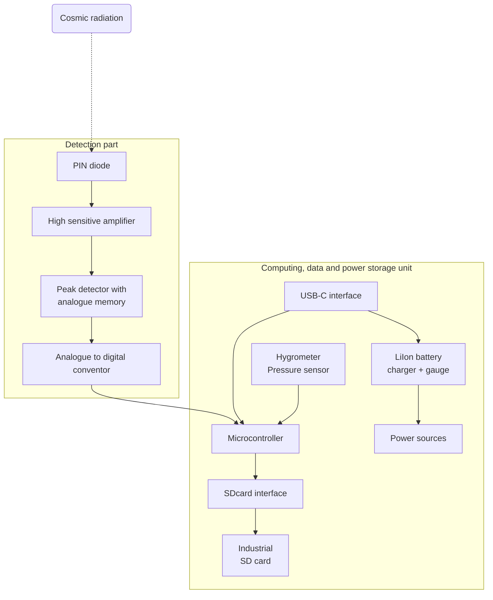

# AIRDOS04

AIRDOS is a state-of-art cosmic radiation dosimeter and spectrometer unit. It is intended for long-term airborne measurement of cosmic radiation and dosimetry in mixed ionizing radiation fields on board aircraft.

The instrument is designed primarily for the dosimetry of cabin crew and flight attendants of commercial flights. Thanks to its design of detachable data-storage and power-source/accumulators, required maintenance time is minimalized. The calibrated AIRDOS04 detector can be placed on-board continuously and it is only necessary to  replace the accumulator/storage module according to the set maintenance interval.

**Vendor Information**: The AIRDOS04 detectors are procured by Universal Scientific Technologies s.r.o. (UST) company. A company specializing in advanced dosimetry and spectrometry equipment. UST is known for their cutting-edge technology and reliable products in the field of radiation detection and measurement. For more details about the company and their officers, please visit their website at www.ust.cz. For any further information or support you can contact us via email support@ust.cz

# Technical parameters
 * Detection element: Silicon PIN diode, volume 44 mm3
 * Effective number of energy channels: 470 ±3 or more
 * Deposited energy range: 60 keV to 7 MeV
 * Energy measurement resolution: 15 ±2 keV or better
 * Service interface and energy source: USB-C PD 2.0 connector
 * Radiation spectra integration time: 10 s
 * Maintenance interval: ~1 month 
 * Maintenance duration: under 5 minutes
 * Size: 166 x 107 x 57 mm
 * Environmental operational conditions
   * Device protection: IP30 rating (fully assembled)
   * Operation temperature range: 0°C to 50°C (32°F to 122°F)
   * Operation humidity conditions: non-condensing, 20% to 80% RH

# Components and Their Functions

## AIRDOS04 - Detection part
The detection part of the AIRDOS04 represents the core of its abilities, designed to provide high sensitivity and precision in cosmic radiation detection. This part of the whole assembly is permanently embedded within an aluminum box, which ensures mechanical durability and protects the sensitive components.

The detection (analogue) part consists of the following key components:

**Analog Part**: This segment contains the high sensitive analog electronics necessary for processing signals from the semiconductor sensing element. It's optimized to minimize noise and maximize sensitivity, crucial for accurate radiation measurement. Analog signals are immediately converted into digital data. This process ensures that the captured data is accurate and detailed enough for quality measurements and real-time signal processing.

**Sensing Element - PIN Diode**: Sensing element of the detection part is a semiconductor PIN diode. Selected for its ability to effectively detect ionizing radiation with high accuracy by absorbing particle energy, the diode is positioned under the top side of the box. Its precise location is clearly marked on the top label of the casing, guiding proper orientation during installation.

The design and structural features of the AIRDOS04's detection part are meticulously crafted to ensure both durability and high performance in cosmic radiation detection. Detection components are permanently in-build within a robust aluminum casing.

The detection part is fixed and non-removable, contrasting with the easily insertable data storage and power modules. This fixed installation is critical as it maintains the integrity and calibration of the sensitive components, ensuring consistent performance over the operational life of the detector.

The detector is designed to allow for easy insertion of data storage and power module. This feature is beneficial for quick maintenance, data module replacement, enabling these maintenance tasks to be completed efficiently without disturbing the detector's core components.

## AIRDOS04 Digital, Data Storage and Power Module
The AIRDOS04B, designed with efficiency and modularity in mind, separates its detection capabilities from its data storage and power supply functions. These functions are executed through interchangeable modules, which also act as processor units with firmware, data storage with high capacity and power source. 

The separation of the data storage and power supply from the detection part results from a desire to enhance the flexibility and ease of maintenance of the AIRDOS04B detector. By compartmentalizing these functions, the detector allows for easier upgrades, maintenance, and customization based on specific user needs or changing technological advancements. 

The concept of an interchangeable digital part significantly reduces the maintenance time required to keep the detector operational. Maintenance on-site (such as on-board aircraft) involves swapping the digital part with another unit that is pre-prepared with a cleared data storage and properly charged batteries.

All the firmware for the detector is also located in this digital part. This ensures that firmware updates can be conducted out of the detection site, off the aircraft, so that the time required for regular maintenance is not extended by firmware updates.

### BATDATUNIT01-EXT - External power source type 
The digital/data module without an accumulator in the AIRDOS04 detector represents a streamlined and efficient approach to data management and power supply. Designed for environments where a continuous external power source is readily available, this module prioritizes data handling and processing capabilities while relying on external power, through a USB-C connection.

This module contains the critical digital components and firmware of the AIRDOS04. Its design facilitates efficient data management, allowing for quick data transfer and analysis when connected to a computer or other devices. The absence of an accumulator is useful in cases where you need to put a detector in places where lithium cells are not permitted.

The integrated data storage of the detector is accessible as a mass-storage device via the USB-C interface. This feature provides fast and user-friendly access to the internal storage, without requiring any external memory readers. More information about initialization of mass-storage mode is written in “Device operations” part of this manual. 

### BATDATUNIT01-BAT - Integrated battery power source type
The accumulator module of the AIRDOS04 detector, above the non-accumulator version (BATDATUNIT01-EXT), offers an integrated energy storage solution. This module is equipped with up to five lithium-ion cells housed in 18650 battery cases, providing a significant power capacity that can sustain the detector's operation for up to  one month. The exact number of cells and therefore capacity could be altered to fit the specific application requirements or restrictions. Contact support@ust.cz to get more details on that topic. 

The battery module could  be continuously connected to a USB-C power supply, functioning similarly to an Uninterruptible Power Supply (UPS). In scenarios where external power supply experiences outages, the accumulator module ensures that the AIRDOS04 continues to operate without interruption, maintaining consistent data collection and detector functionality.

# Logical structure

# AIRDOS04 handling instructions

## Attaching/Detaching digital unit 
The process of removing and inserting the data unit (BATDATUNIT01) is an important procedure that should be carried out with care to ensure the functionality and integrity of the AIRDOS04 detector.

### Removal Procedure:
1. **Unscrew the Securing Screws**: Start by unscrewing the pair of large-headed screws. These are designed to secure the data unit within the aluminum casing of the detector.
1. **Pull the Ribbon to Remove the Front Part**: Once the screws are removed, gently pull the ribbon along the axis of the box to remove the data unit from the box.

### Insertion Procedure:
1. **Align the Data Unit**: Carefully align the data unit with the slots inside the aluminum casing. This ensures that the unit will slide in easily without any excessive force that might damage the components.
1. **Gentle Insertion**: Slide the data unit into the casing with a steady motion until it is fully attached in its designated position.
1. **Secure with Screws**: Reinsert the large-headed screws and tighten them to secure the data unit within the detector. Do not over-tighten, as this may strip the threads. The overtightening is indicated by deformation or damage of the front panel.

## Detector power-up
The detector is turned on immediately after the digital part is inserted into the detector box. The activation is indicated by several flashes of the LED lights and short sound beep. If everything works correctly , the LED lights will turn off, and the device will start detecting and recording the radiation particles. In this case, to minimize power consumption, the LED lights are off and only blink during data writing to the internal memory, which is approximately once every 10 seconds after each exposure.

In case of an error, the LED lights will start blinking or light up continuously, and the device will automatically shutdown after approximately 10 seconds. 

In the unlikely situation when BATDATUNIT01 is already inserted into the AIRDOS04 and is powered off, you can turn it on by holding down the 'Power button' for one second. The indication of activation is realized in the same way as in case of module insertion. The last way of turning on the detector is by connecting external power (USB-C connector). In this state, the detector is always powered on.

When the detector’s data part is inside the box and it is connected to a USB-C power source, the device will initiate charging while continuing its particle detection operations.

Conversely, if the data part is outside the box and a USB connection is established, the detector switches to a mass-storage mode. This mode allows for data transfer to your computer, but the particle detection function is inactive during this period. In this mode LED3 (green) is continuously lit-up.

## Measured data read-out (enforcing mass-storage mode)
Mass-storage mode is automatically activated when the data unit (BATDATUNIT01) is the USB-C connected and , when the digital part is detached from the detection part (i.e., the module is removed from the AIRDOS04 box). This feature simplifies the process of accessing and managing the data stored in the detector, as it removes the need for manual activation of mass-storage mode. Functions as a mass-storage device, allowing for straightforward data transfer/read-out. 

Device should automatically appear in your computer system as a mass-storage device or as generic external disk storage. 

## Battery level
The battery charge level of the accumulator module can be easily determined by pressing the "Power" button. The charge level is displayed using 8 LED lights, which represent the level from 0-100% charge. This feature provides a straightforward and quick method for users to gauge the remaining power in the accumulator, ensuring they can effectively manage the detector's usage and charging schedule.

## Battery charging
The accumulator module (BATDATUNIT01-BAT) begins charging automatically upon connecting a USB to the USB-C connector. The charging process is intentionally slow for two primary reasons:

**Battery Life Extension and Capacity Maximization**: Slow charging is a strategic choice to extend the lifespan of the batteries and to maximize the charged capacity. This approach ensures that the batteries maintain their efficiency and longevity over multiple charging cycles, which is crucial for the continuous and reliable operation of the AIRDOS04 detector.

**Compatibility with the most of Standard USB 2.0 Ports**: The module is designed to be charged using a regular USB 2.0 port commonly found on computers. This design consideration enhances the versatility of the charging process, allowing users to recharge the module with any available USB 2.0 ports without needing specialized charging equipment.

The presence of sufficient power supply for the accumulator module is indicated by the "Power in" green LED. The progress of the charging process is displayed by the "Charging" orange LED light. Once the battery is fully charged, the "Charging" LED light will turn off, signaling that the charging process is complete. This visual indication system provides users with an easy and intuitive way to monitor the charging status and power availability of the device.

# Standard maintenance
Standard maintenance steps of the AIRDOS04 detector involve routine procedures essential for conducting long-term measurements. These maintenance tasks primarily include following steps. For more detailed instructions, please, refer to our online form of this manual.

1. **Replacing the Digital Part of the Detector**: Periodical swapping out the digital module ensures continuous operation and minimizes downtime/maintenance time. This is particularly important in scenarios where the detector is used for extended periods.
1. **Downloading Recorded Data**: Periodically downloading data from the detector's storage is crucial for both data analysis and clearing storage space for ongoing measurements. This process is facilitated by the detector's user-friendly data retrieval system.
1. **Recharging the Batteries**: For variants with an accumulator, ensuring the batteries are regularly charged is important. This maintains the detector’s autonomous operation capability, especially in situations where a continuous external power source is not available.

Adhering to these standard maintenance procedures will ensure that the AIRDOS04 operates efficiently and reliably over extended periods, providing accurate and consistent measurement results.

## Replacing the Digital Part of the Detector:
1. **Prepare a New Digital Part**: Ensure you have a spare digital part that has empty data storage and is fully charged, therefore ready to replace the one currently in use.
1. **Unscrew the Securing Screws**: Begin by unscrewing the two large-headed securing screws on the detector. 
1. **Remove the Used Digital Part**: Gently pull the ribbon to slide out the used digital part of the detector. 
1. **Insert the New Digital Part**: Carefully insert the new digital part into the detector. Ensure it is aligned correctly for smooth insertion.
1. **Verify Operation**: Once the new digital part is fully inserted, check that the detector powers on and starts measuring. This step is crucial to confirm that the replacement was successful and the detector is functioning correctly.
1. **Secure the Digital Part with Screws**: Finally, secure the newly inserted digital part with the two screws. This will ensure that the digital module remains firmly in place during operation.

## Downloading Recorded Data to a User's Computer:
1. **Remove the Digital Module**: Ensure the digital/storage module is removed from the Detection aluminum box. Wait until the detector shutdown (indicated by a beep, approximately  10 seconds after pull-out of the module from AIRDOS04).
1. **Connect via USB-C**: Attach the USB-C cable from your computer to the detector's digital BATDATUNIT01 module.
1. **Access the Mass-Storage Device**: Your computer should now recognize a connected portable mass-storage device.
1. **Download and Delete Data**: Transfer the recorded data to your computer. After successfully transferring, make sure to completely delete the original data from the module to free up space for new recordings.
1. **Disconnect the Storage from Computers OS**: Safely eject the mass-storage device from your computer.
1. **Optional Disconnection of USB-C cable**: If you do not intend to charge the detector, you can disconnect the cable from the USB connector at this point.

## Recharging the Batteries
To ensure the proper charging of the BATDATUNIT01-BAT module, follow these steps:

1. **Acquire a USB Power Source**: This can be a USB adapter or a computer equipped with a USB 2.0 port. The power source must be capable of providing at the least 0.5 A of current.
1. **Connect the USB-C to USB-A Cable**: Insert the USB-C end of the cable into the data unit and the USB-A end into the power source.
1. **Verify the Charging Process**: Look for the "Power-in" and "Charging" LED indicators on the data unit. The "Power-in" LED should be constantly lit, and the "Charging" LED should remain on to indicate that charging is continuing. Flashing charging LED indicates an error or an issue with the li-ion cells.
1. **Check for Full Charge**: Once the batteries are fully charged, the "Charging" LED will turn off, the "Power-in" LED will stay on, signaling that the charging process is complete and the unit is ready for use. You can check the battery level by pressing the “Power” button. 

To ensure maximal safety it is suggested to leave the fully charged module resting for at least one hour. This procedure releases internal mechanical stress from the accumulator's build-up during the charging.
