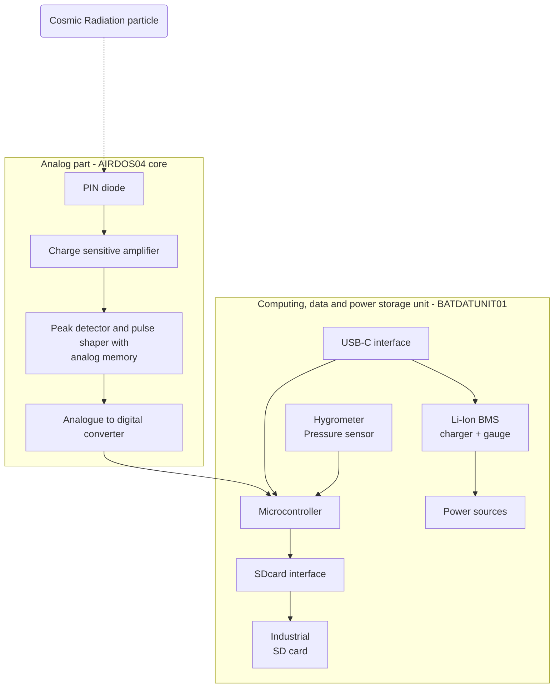

# AIRDOS04 - user manual

AIRDOS is a radiation dosimeter and spectrometer intended for long-term airborne measurement of cosmic radiation and dosimetry in mixed ionizing radiation fields on board aircraft.

# Detector Components and Functions

## AIRDOS04 - Detection part

The detection part of the AIRDOS04 represents the core of its abilities, designed to provide high sensitivity and precision in cosmic radiation detection. This part of the whole assembly is permanently embedded within an aluminum box, which ensures mechanical durability and protects the sensitive components.

The detection (analog) part consists of the following key components:

**Analog Part**: This segment contains the highly sensitive analog electronics necessary for processing signals from the semiconductor sensing element. It's optimized to minimize noise and maximize sensitivity, which is crucial for accurate radiation measurement. Analog signals are immediately converted into digital data. This process ensures that the captured data is accurate and detailed enough for quality measurements and real-time signal processing.

**Sensing Element - PIN Diode**: The sensing element of the detection part is a semiconductor PIN diode. Selected for its ability to effectively detect ionizing radiation with high accuracy by absorbing particle energy, the diode is positioned under the top side of the box. Its precise location is marked on the top label of the casing, guiding proper orientation during installation.

The design and structural features of the AIRDOS04's detection part are meticulously crafted to ensure both durability and high performance in cosmic radiation detection. Detection components are permanently built into a robust aluminum casing.

The detection part is fixed and non-removable, contrasting with the easily insertable data storage and power modules. This fixed installation is critical as it maintains the integrity and calibration of the sensitive components, ensuring consistent performance over the operational life of the detector.

The detector is designed to allow for easy insertion of data storage and power modules. This feature is beneficial for quick maintenance and data module replacement, enabling these maintenance tasks to be completed efficiently without disturbing the detector's core components.

## AIRDOS04`s Digital, Data Storage, and Power Module

The AIRDOS04 is designed with efficiency and modularity in mind, separating its detection capabilities from its data storage and power supply functions. These functions are executed through interchangeable modules, which also act as processor units with firmware, data storage with high capacity, and power sources.

Visit more information:

[BATDATUNIT01](./BATDATUNIT01){: .btn .btn-green }

# AIRDOS04 handling instructions

## Attaching/Detaching digital unit

The process of removing and inserting the data unit (BATDATUNIT01) is an important procedure that should be carried out with care to ensure the functionality and integrity of the AIRDOS04 detector.

### Removal Procedure:

 

   <iframe style="width: 100%;height: 100%;position: absolute;top: 0;left: 0;" src="https://www.youtube.com/embed/jfwqo6pnUCM?loop=1">
   </iframe>
 

 * **Unscrew the Securing Screws**: Start by unscrewing the pair of large-headed screws. These are designed to secure the data unit within the aluminum casing of the detector.
 * **Pull the Ribbon to Remove the Front Part**: Once the screws are removed, gently pull the ribbon along the axis of the box to remove the data unit from the box.

### Insertion Procedure:

 * **Align the Data Unit**: Carefully align the data unit with the slots inside the aluminum casing. This ensures that the unit will slide in easily without any excessive force that might damage the components.
 * **Gentle Insertion**: Slide the data unit into the casing with a steady motion until it is fully attached to its designated position.
 * **Secure with Screws**: Reinsert the large-headed screws and tighten them to secure the data unit within the detector. Do not over-tighten, as this may strip the threads. The overtightening is indicated by deformation or damage of the front panel.

## Detector power-up

 

   <iframe style="width: 100%;height: 100%;position: absolute;top: 0;left: 0;" src="https://www.youtube.com/embed/5E_j_orvsTs?loop=1">
   </iframe>
 

The detector is turned on immediately after the digital part is inserted into the detector box. The activation is indicated by several flashes of the LED lights and a short sound beep. If everything works correctly, the LED lights will turn off, and the device will start detecting and recording the radiation particles. In this case, to minimize power consumption, the LED lights are off and only blink during data writing to the internal memory, which is approximately once every 10 seconds after each exposure.

In case of an error, the LED lights will start blinking or light up continuously, and the device will automatically shut down after approximately 10 seconds.

In the unlikely situation when BATDATUNIT01 is already inserted into the AIRDOS04 and is powered off, you can turn it on by holding down the 'Power button' for one second. The indication of activation is realized in the same way as in the case of module insertion. The last way of turning on the detector is by connecting external power (USB-C connector). In this state, the detector is always powered on and records radiation data continuously until the detector is powered off.

{: .highlight }
The detector is impossible to power off by any of the buttons. The only method to power off the device is either to remove the BATDATUNIT from the AIRDOS or use special commands on the USB-C port. Inspect the [airdoscontrol utility](https://github.com/UniversalScientificTechnologies/AIRDOS04/tree/AIRDOS04A/sw) description for more details. 

When the detector’s data part is inside the box and is connected to a USB-C power source, the device will initiate charging while continuing its particle detection operations.

Conversely, if the data part is outside the box and a USB connection is established, the detector switches to a mass-storage mode. This mode allows for data transfer to your computer, but the particle detection function is inactive during this period. In this mode, LED3 (green) is continuously lit.

## Battery level

 

   <iframe style="width: 100%;height: 100%;position: absolute;top: 0;left: 0;" src="https://www.youtube.com/embed/BMAA3ZnrR8o?loop=1">
   </iframe>
 

The battery charge level of the accumulator module can be easily determined by pressing the "Power" button. The charge level is displayed using 8 LED lights, which represent the level from 0-100% charge. This feature provides a straightforward and quick method for users to gauge the remaining power in the accumulator, ensuring they can effectively manage the detector's usage and charging schedule.

## Battery charging

 

   <iframe style="width: 100%;height: 100%;position: absolute;top: 0;left: 0;" src="https://www.youtube.com/embed/qtMtmowHTfo?loop=1">
   </iframe>
 

The accumulator module (BATDATUNIT01-BAT) begins charging automatically upon connecting a USB to the USB-C connector. The charging process is intentionally slow for two primary reasons:

**Battery Life Extension and Capacity Maximization**: Slow charging is a strategic choice to extend the lifespan of the batteries and maximize the charged capacity. This approach ensures that the batteries maintain their efficiency and longevity over multiple charging cycles, which is crucial for the continuous and reliable operation of the AIRDOS04 detector.

**Compatibility with most Standard USB 2.0 Ports**: The module is designed to be charged using a regular USB 2.0 port commonly found on computers. This design consideration enhances the versatility of the charging process, allowing users to recharge the module with any available USB 2.0 ports without needing specialized charging equipment.

The presence of a sufficient power supply for the accumulator module is indicated by the "Power in" green LED. The progress of the charging process is displayed by the "Charging" orange LED light. Once the battery is fully charged, the "Charging" LED light will turn off, signaling that the charging process is complete. This visual indication system provides users with an easy and intuitive way to monitor the charging status and power availability of the device.

# Standard maintenance

Standard maintenance steps of the AIRDOS04 detector involve routine procedures essential for conducting long-term measurements. These maintenance tasks primarily include the following steps. For more detailed instructions, please refer to our online version of this manual.

 * **Replacing the Digital Part of the Detector**: Periodical swapping out of the digital module ensures continuous operation and minimizes downtime/maintenance time. This is particularly important in scenarios where the detector is used for extended periods.
 * **Downloading Recorded Data**: Periodically downloading data from the detector's storage is crucial for both data analysis and clearing storage space for ongoing measurements. This process is facilitated by the detector's user-friendly data retrieval system.
 * **Recharging the Batteries**: For variants with an accumulator, ensuring the batteries are regularly charged is important. This maintains the detector’s autonomous operation capability, especially in situations where a continuous external power source is not available.

Adhering to these standard maintenance procedures will ensure that the AIRDOS04 operates efficiently and reliably over extended periods, providing accurate and consistent measurement results.

## Replacing the Digital Part of the Detector

To analyze the AIRDOS04 logged data is mandatory to note the precise time of power on and shutdown. These time points allow fitting the recorded data log to real aircraft flight data.  

 

   <iframe style="width: 100%;height: 100%;position: absolute;top: 0;left: 0;" src="https://youtube.com/embed/oRRdgOo-tw0">
   </iframe>
 

The procedure for getting the absolute time of detector shutdown consists of the following steps:

1. Unscrew completely the AIRDOS digital module locking screws
2. Prepare the "date" command on a computer with a synchronized real-time clock
2. Pull out the digital module from AIRDOS
3. Wait for a beep signal and press Enter in the command line
4. Reuse the command for the second beep.

The last recording of the data log corresponds to the time of the first beep, subtracting the integration time. In the case of simply changing the digital part, the procedure follows

1. **Prepare a New Digital Part**: Ensure you have a spare digital part that has empty data storage and is fully charged, therefore ready to replace the one currently in use.
1. **Unscrew the Securing Screws on AIRDOS**: Begin by unscrewing the two large-headed securing screws on the detector in case it does not been done yet.
1. **Remove the Used Digital Part**: Gently pull the ribbon to slide out the used digital part of the detector.
1. **Insert the New Digital Part**: Carefully insert the new digital part into the detector. Ensure it is aligned correctly for smooth insertion.
1. **Verify Operation**: Once the new digital part is fully inserted, check that the detector powers on and starts measuring. This step is crucial to confirm that the replacement was successful and the detector is functioning correctly.
1. **Secure the Digital Part with Screws**: Finally, secure the newly inserted digital part with the two screws. This will ensure that the digital module remains firmly in place during operation.

## Downloading Recorded Data to a User's Computer

 

   <iframe style="width: 100%;height: 100%;position: absolute;top: 0;left: 0;" src="https://www.youtube.com/embed/uuGJzn98xzY?loop=1">
   </iframe>
 

Mass-storage mode is automatically activated when the data unit (BATDATUNIT01) is USB-C connected and when the digital part is detached from the detection part (i.e., the module is removed from the AIRDOS04 box). This feature simplifies the process of accessing and managing the data stored in the detector, as it removes the need for manual activation of mass-storage mode. Functions as a mass-storage device, allowing for straightforward data transfer/read-out.

1. **Remove the Digital Module**: Ensure the digital/storage module is removed from the Detection aluminum box. Wait until the detector shuts down (indicated by a beep, approximately  10 seconds after pull-out of the module from AIRDOS04).
1. **Connect via USB-C**: Attach the USB-C cable from your computer to the detector's digital BATDATUNIT01 module.
1. **Access the Mass-Storage Device**: Your computer should now recognize a connected portable mass-storage device.
1. **Download and Delete Data**: Transfer the recorded data to your computer. After successfully transferring, make sure to completely delete the original data from the module to free up space for new recordings.
1. **Disconnect the Storage from the Computer OS**: Safely eject the mass-storage device from your computer.
1. **Optional Disconnection of USB-C cable**: If you do not intend to charge the detector, you can disconnect the cable from the USB connector at this point.

## Recharging the Accumulators

To ensure the proper charging of the Li-Ion accumulators in the BATDATUNIT01-BAT module, follow these steps:

 * **Acquire a USB Power Source**: This can be a USB adapter or a computer equipped with a USB 2.0 port. The power source must be capable of providing at least 0.5 A of current.
 * **Connect the USB-C to USB-A Cable**: Insert the USB-C end of the cable into the data unit and the USB-A end into the power source.
 * **Verify the Charging Process**: Look for the "Power-in" and "Charging" LED indicators on the data unit. The "Power-in" LED should be constantly lit, and the "Charging" LED should remain on to indicate that charging is continuing. A flashing charging LED indicates an error or an issue with the Li-ion cells.
 * **Check for Full Charge**: Once the batteries are fully charged, the "Charging" LED will turn off, and the "Power-in" LED will stay on, signaling that the charging process is complete and the unit is ready for use. You can check the battery level by pressing the “Power” button.

To ensure maximal safety, it is suggested to leave the fully charged module resting for at least one hour. This procedure releases internal mechanical stress from the accumulator's build-up during charging.

# Operational notes for AIRDOS04

## Detector Placement in Aircraft

The AIRDOS04 detector assembly is designed to fit into the manual bay of commercial aircraft, a location that should accommodate up to two AIRDOS04 units. When selecting the placement of the detector within an aircraft, there are critical factors to consider to ensure accurate measurements and the longevity of the device:

 * **Consideration of Aircraft Structure**: The surrounding structure of the aircraft can significantly influence the measured spectrum, fluence, and type of incoming particles. It's essential to choose a location where the impact of the aircraft's structure on the detector's readings is minimized or known.
 * **Avoidance of High-Vibration Areas**: The detector should be placed in an area that is relatively free from excessive vibrations. High vibration levels can affect the detector's performance (false detections due to microphone/piezo effects in highly sensitive analog components) and potentially cause damage or calibration degradation to its sensitive components in case of extreme vibrations.
 * **Default placement Orientation**: The standard placement orientation for the AIRDOS04 is on a flat, horizontal surface. On the bottom side of the detector's box, rubber feet are placed to ensure stability. These feet provide multiple purposes: they minimize movement on smooth surfaces, provide good adherence to the placement surface, and help eliminate the transfer of vibrations into the system. This design feature is crucial for maintaining the accuracy of the detector’s measurement from the adverse effects of unnecessary movement or vibration.
 * **Avoidance of Direct Sunlight**: The detector should not be placed in areas with direct exposure to sunlight. Prolonged exposure to direct sunlight or high temperatures can lead to internal overheating and potentially affect the detector's performance and durability.
 * **Environmental Condition Limits**: The AIRDOS04 should operate within certain environmental limits to ensure its effectiveness and safety. Given its IP30 rating, it is not designed to withstand direct exposure to water or dust. Recommended operational environmental conditions include:
   - **Temperature Range**: Ideally, the detector should operate within a temperature range of 0°C to 50°C (32°F to 122°F) to ensure optimal performance.
   - **Humidity Range**: A non-condensing humidity level of 20% to 80% is advisable for the stable operation and calibration of the detector.

By taking these factors into account, the AIRDOS04 can be optimally positioned within an aircraft to ensure precise and reliable cosmic radiation measurements, while also maintaining the detector's output data integrity.

## Status indicator description

The front panel of the BATDATUNIT01 module features various indicators and interfaces that provide essential information about the device's status and functionalities:

 * **USB-C Port**: This is the interface for power input and data communication. When connected to a computer or power source, it facilitates charging the battery and accessing the data storage.
 * **Power In LED**: This LED light indicates when power is being supplied to the module through the USB-C port.
 * **Charging LED**: This LED lights when battery charging is active.
 * **Battery Level Indicators**: A series of LED lights display the current battery charge level. When the 'Power' button is pressed, these lights will illuminate to show how much charge remains in the accumulator, ranging from empty (0%) to full (100%).
 * **Power Button**: Pressing this button will power the module on, and when held, it will display the current battery level using the battery level indicators. Holding this button for more than 10 seconds causes a restart of the device.
 * **Data Transmission LEDs (RX/TX)**: These LEDs indicate active data transmission when the module is connected to a raw data interface, such as a computer. This is not applicable in mass-storage access mode
 * **LED Indicators (LED1, LED2, LED3)**: This set of LEDs indicates the status of the microcontroller unit (MCU), which is the central processor of the module, running the firmware and controlling the device's operations. These LEDs can be used to indicate specific statuses or alerts as defined by the device's firmware.
   - LED3 (Orange) - Detection exposure is done, writing data to data storage
   - LED2 (Red) - It is not possible to write data to internal storage. In the case of this indicator, check the status of integrated mass storage.
   - LED1 (green) - mass-storage mode accessible through USB

## Routine checks

Routine checks are an optional part of using the AIRDOS04 detector. The following procedures could be performed regularly by the operating personnel. Performing these routine checks will ensure that the AIRDOS04 detector is operating properly and has sufficient power for continued use without any disruptions. These simple procedures are crucial for long-term measurement scenarios.

### Check of Data Recording activity indicator

 

   <iframe style="width: 100%;height: 100%;position: absolute;top: 0;left: 0;" src="https://www.youtube.com/embed/OLHI1WTeeHw?loop=1">
   </iframe>
 

**LED Blink Indicator**: To confirm that the detector is actively recording data, observe the LED lights. The detector blinks its LED indicator (MCU LEDs) after each exposure (usually 10 seconds long, depending on FW configuration), indicating that the spectrum has been written to the built-in memory media. This visual cue is an easy way for the operator to verify that the device is functioning correctly and data is being captured.

### Checking Battery Level (Applicable for BATDATUNIT01-BAT only)

 

   <iframe style="width: 100%;height: 100%;position: absolute;top: 0;left: 0;" src="https://www.youtube.com/embed/BRZ_Ix2QTNE?loop=1">
   </iframe>
 

**Using the Power Button**: For units equipped with the BATDATUNIT01-BAT, the battery level can be checked using the 'Power' button. An approximately 1s-long press and release of this button will display the current battery level through the LED indicator. For more detailed information about obtaining the battery level, refer to the 'Battery Level' section of the manual.

# Advanced maintenance

## Data Storage Maintenance

The data storage within the BATDATUNIT01 is an industrial-grade SLC-mode SD card, which provides high reliability and endurance. However, in environments with increased radiation, the SD card may experience accelerated aging and could potentially fail sooner than in ground conditions. To prevent data loss and maintain the integrity of recorded information, the following guidelines are recommended:

 * **Preventive Replacement**: It is strongly advised to preemptively replace the SD card annually. This proactive measure ensures that the data storage remains reliable and the risk of data corruption or loss is minimized.
 * **Correct SD Card Type**: Always use the specified type of SD card to ensure compatibility and reliability. Using an incorrect type of SD card may result in data loss or operational issues.

For more information on the availability and specifications of the recommended SD card, users should contact technical support at support@ust.cz. The support team can provide guidance on purchasing the correct SD card and offer assistance with any other technical inquiries.

## Firmware update

Updating the firmware of your AIRDOS particle detector is an important process for ensuring the device is equipped with the latest features and any known bugs are solved. AIRDOS04 firmware is completely located in the BATDATUNIT module.  Please follow the instructions in [BATDATUNIT01 firmware update section](/airdos/BATDATUNIT01#firmware-update). 

# Data Evaluation

The data measured by the instrument are stored in its integrated data storage. Data files can be obtained following the procedure described in the "Downloading Recorded Data to a User's Computer" section. The format description of these files is available on the device's documentation website and depends on the device's firmware. These files can be analyzed with custom software tools based on [this example script](https://github.com/UniversalScientificTechnologies/AIRDOS04/blob/AIRDOS04A/notebooks/flight_dose_calculation.ipynb), or you can use the [dosportal](https://portal.dos.ust.cz) web application for managing and evaluating data measured by UST instruments.

# Troubleshooting

## Common Issues and Solutions

**Issue**: The detector does not turn on after the digital part is inserted into the detector box.

**Potential cause**: The accumulators are completely exhausted.

**Solution**: The detector can be turned on manually by holding down the 'Power button' for 1 second. Try to recharge.

**Potential cause**: Check the temperature of the environment and the detector. The device does not turn on automatically when the temperature is high.

**Solution**: The detector over-temperature lock can be overridden and turned on manually by holding down the 'Power button' for 1 second.

# Recycling and Disposal

This is a high-end aerospace electronic device containing removable Li-ion cells in a 18650 casing. Before disposal, remove the cells from the device. Dispose of the rechargeable Li-ion cells according to the regulations of your country. The rest of the device constitutes electronic waste without additional batteries; dispose of it according to the regulations of your country. The device is not RoHS compliant because it contains lead solder to meet aerospace industry standards.

# Safety Instructions and Warranty

The BATDATUNIT01 module contains up to five lithium-ion cells encased in 18650, providing a reliable and rechargeable power source for the AIRDOS04 detector. These cells are specifically chosen for their durability, safety, high energy density, and ability to maintain a consistent charge over numerous usage cycles, ensuring sustained operation of the detector in various field conditions.
Universal Scientific Technologies s.r.o. shall not be liable for any damages, injuries, or regulatory non-compliance arising from improper use, maintenance, or unauthorized alterations of the device.
The device is covered by a two-year limited warranty.
Unauthorized interventions in the device or handling that contradict the instructions provided in the manual and the detector's online documentation will result in the loss of warranty.

# Product Changelog

### 2025/5 – AIRDOS04C Release
- SD card storage size increased to 2 GB.
- Improved analog section allowing:
  - Extended energy range: 40 keV to ~80 MeV
  - Increased number of energy channels: 65,536
- Analog part remains backward-compatible with previous revisions of AIRDOS04.
- Fully compatible with all revisions of digital module [BATDATUNIT01](https://docs.dos.ust.cz/airdos/BATDATUNIT01).

### 2023/12 – AIRDOS04B Release
- The **AIRDOS04B** was the first revision commercially available.

### 2023/11 – AIRDOS04A
- Internal prototype

