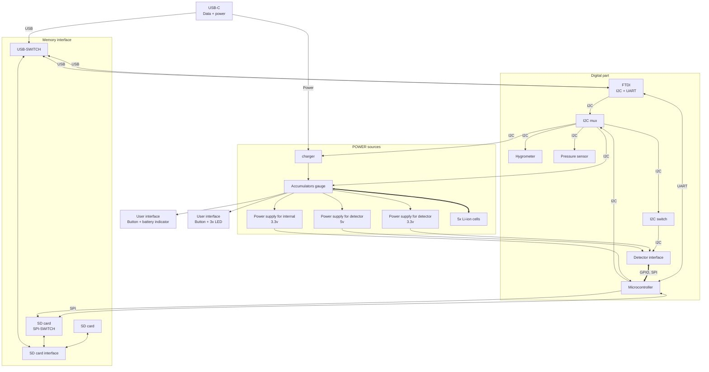

# BATDATUNIT01

The BATDATUNIT01 is a specialized module optimized for use in the AIRDOS04 series of detectors. It contains as a critical component, combining both data storage and power supply functionalities in a single, compact unit. This integration simplifies the detector's design and enhances its ease of use, particularly in scenarios requiring mobility and efficiency.

1. **Integrated Data Storage and Power Supply**: The BATDATUNIT01 is equipped with substantial data storage capacity, allowing for extensive data accumulation over prolonged periods. It also includes a built-in power source, which is important for the detector's long-term autonomous operation, or in the cases in environments where external power may not be readily available.

1. **Embedded Processor with Firmware**: BATDATUNIT01 contains microcontroller unit that controls the entire detector system and peripherials. This processor is loaded with the firmware, ensuring proper detector operation and can be easily updated with new features or improvements.

1. **Environmental Sensors**: The module is fitted with internal sensors, including a thermometer, hygrometer, and barometer. These sensors provide valuable data on the ambient temperature, humidity, and atmospheric pressure, factors that can be important for more precise data processing.

1. **USB Mass-Storage Interface**: For data management, the module is equipted with a USB mass-storage interface, allowing users to easily access and transfer data from the module. This feature makes the process of data retrieval and analysis straightforward and user-friendly.

1. **Modular design**: The module is specifically designed for quick installation and removal, without any advanced tools. This design ensures that the AIRDOS04 can be maintained and operated with minimal hassle.

## Internal structure

