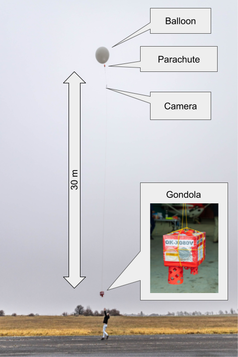
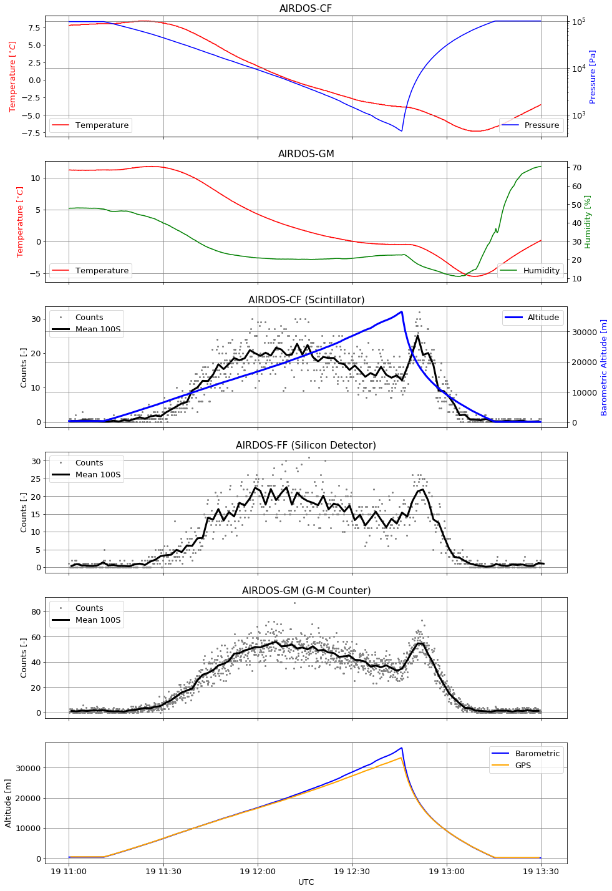
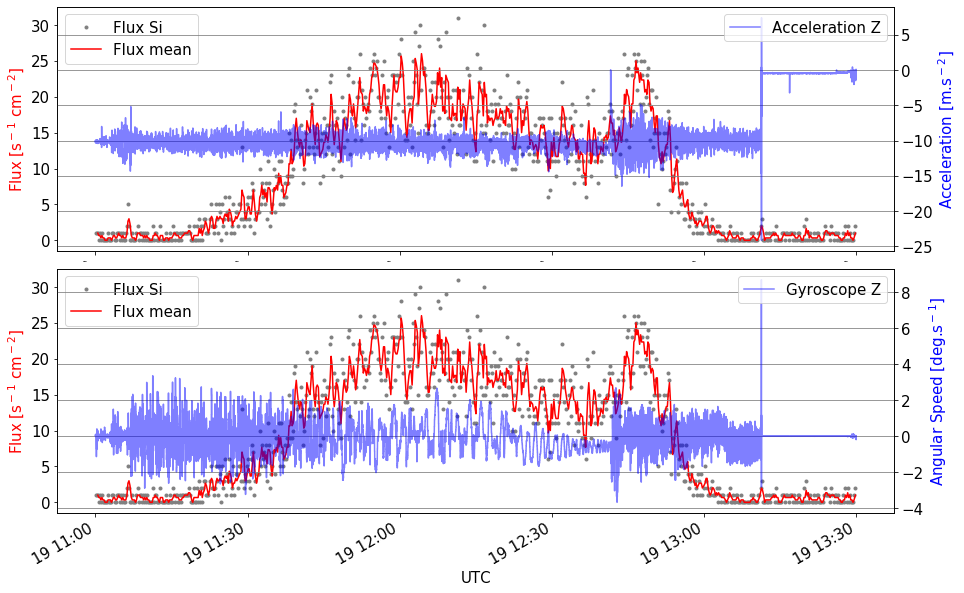
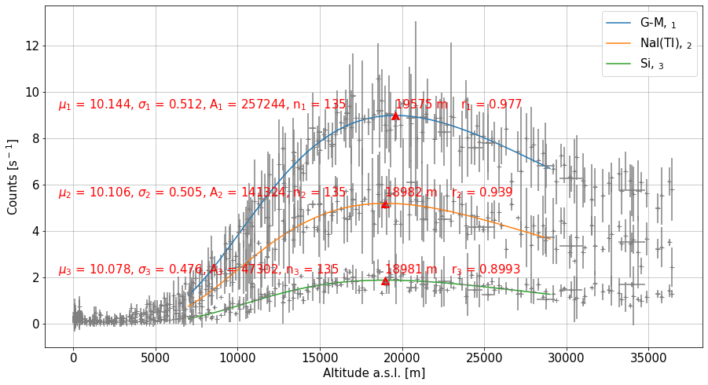
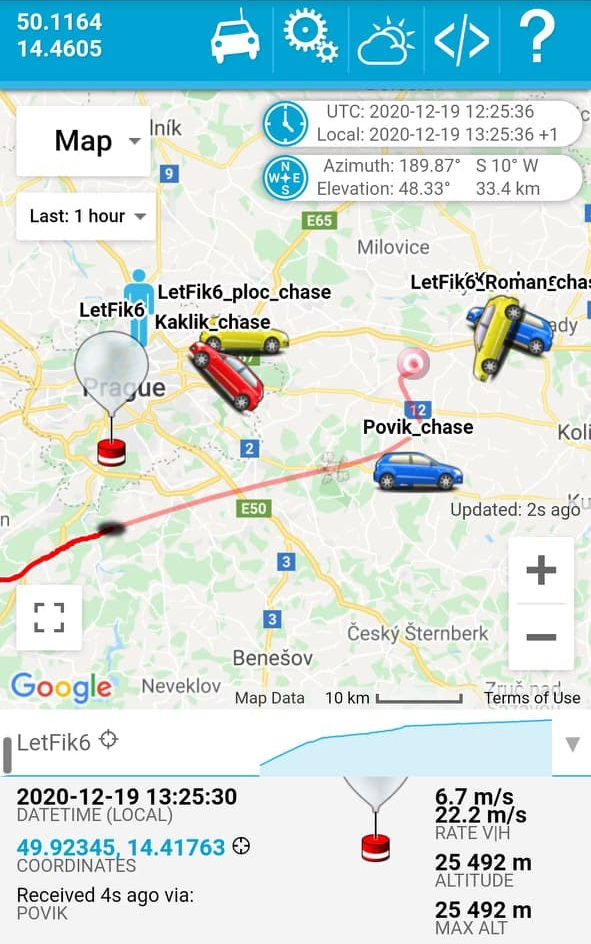
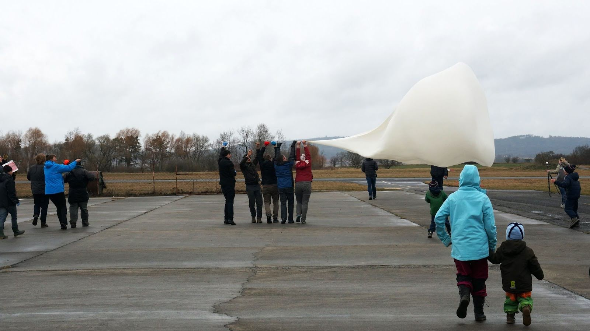

# Stratospheric balloon campaigns with AIRDOS-class detectors

AIRDOS detectors have been the primary scientific payload in a series of **FIK** stratospheric balloon flights operated jointly with the [Nuclear Physics Institute of the Czech Academy of Sciences](https://www.ujf.cas.cz/en) in Řež. The flights serve a dual purpose:

1. **Atmospheric radiation mapping** — establishing the altitude dependence of secondary cosmic radiation up to ~30 km and the location of the [Regener–Pfotzer maximum](#regenerpfotzer-maximum).
2. **Instrument qualification** — testing AIRDOS and other detector designs against the temperature, pressure, mechanical, and electromagnetic environment of a stratospheric flight before they are deployed on a longer mission (UAV, satellite).

## Multi-detector payload

A typical FIK-6 payload combined three different radiation detectors so that they could be cross-calibrated against the same air column on a single ascent:

* [SPACEDOS](/spacedos/) — silicon PIN diode sensor, low mass, low power, very high resistance to mixed-field events.
* AIRDOS-C — scintillation detector with a small NaI(Tl) crystal coupled to a SiPM.
* G-M tube (STS-5) — high-volume Geiger–Müller counter for total-flux reference.

All three detectors plus the supporting sensors (T/p/RH, IMU, GNSS) were carried inside a polystyrene gondola flown by a Hwoyee Weather Balloon 1600 in the FIK-6 configuration:

The TF-ATMON-based avionics recorded the full sensor suite throughout each flight. An example of the raw data — temperatures, pressure, humidity, three detector count rates, and altitude — from FIK-6:

## Why telemetry data matters

The combined flight + radiation record shows several effects that would have been misinterpreted without simultaneous mechanical telemetry. The acceleration and angular-rate trace from the IMU reveals that the silicon PIN diode count rate spikes at takeoff, balloon burst, and landing — a **microphonic** effect of the detector electronics, *not* a real radiation increase. The increased noise during the descent is similarly associated with rotation and high angular rates of the gondola:

The TF-ATMON architecture, with balloon-specific avionics decoupled from the detector payload, makes this kind of cross-correlation routine — every payload publishes its data to the same logger, sharing time, position and environmental context.

## Regener–Pfotzer maximum

A central result of the FIK campaign is the joint determination of the altitude of the Regener–Pfotzer maximum from all three detector types on the same air column. A log-normal fit to the measured count rate vs. altitude gives a maximum near **19 km** for all three detectors (G-M tube, NaI(Tl) scintillator, and silicon PIN diode):

The methodology, including the use of TF-ATMON and the comparison across detector types, is reported in: J. Kákona et al., [_Measurement of the Regener–Pfotzer maximum using different types of ionising radiation detectors and a new telemetry system TF-ATMON_](https://doi.org/10.1093/rpd/ncac124), Radiat. Prot. Dosim. 198(9–11): 712–719, 2022, and extended to latitudinal effects in [Ambrožová et al., 2023](https://doi.org/10.1093/rpd/ncac299).

## Recovery and operational notes

The TF-ATMON telemetry also makes balloon recovery practical: position and trajectory prediction were precise enough during the FIK-6 flight that the rescue team could observe the gondola touchdown directly and recover it within minutes:

The main open challenge is launching balloons under the strong wind conditions that typically precede thunderstorm activity — these are exactly the conditions of scientific interest, but they are also when the gondola is most likely to impact terrain or the launching operator:

This is one of the reasons for the parallel development of the [TF-G2 autogyro](https://docs.thunderfly.cz/instruments/TF-G2) UAV platform — a controllable carrier that can position the same detectors in or near a storm cell with much higher reliability than an uncontrolled balloon. The latest [AIRDOS03](/airdos/AIRDOS03) variant was designed specifically for that UAV use.

## Available platform — TF-B1 balloon kit

The avionics that flew the later FIK missions has been productized as the **[TF-B1 stratospheric balloon kit](https://docs.thunderfly.cz/instruments/TF-B1/)**, available from ThunderFly. The kit is a complete carrier: airframe, TF-ATMON avionics with redundant telemetry (TFSIK01 + TFLORA01), GNSS tracking and recovery beacon, modular UART payload interface, and battery system suitable for stratospheric temperatures. Any AIRDOS-, SPACEDOS- or GEODOS-class detector can be attached as a TF-ATMON payload without writing platform-specific firmware — the on-board logger records the payload data together with synchronized environment and trajectory information out of the box.

For groups planning a stratospheric campaign without first having to develop their own balloon avionics, TF-B1 is the recommended starting point.

## Related publications

* J. Kákona et al., [_Measurement of the Regener–Pfotzer maximum using different types of ionising radiation detectors and a new telemetry system TF-ATMON_](https://doi.org/10.1093/rpd/ncac124), Radiat. Prot. Dosim. 198(9–11): 712–719, 2022.
* I. Ambrožová et al., [_Latitudinal effect on the position of Regener–Pfotzer maximum investigated by balloon flight HEMERA 2019 in Sweden and balloon flights FIK in Czechia_](https://doi.org/10.1093/rpd/ncac299), Radiat. Prot. Dosim. 199(15–16): 2041–2046, 2023.
* J. Kákona, [_Detection of Electromagnetic Phenomena in the Atmosphere – Integrating Advanced Instrumentation and UAVs for Enhanced Atmospheric Research_](https://dspace.cvut.cz/handle/10467/120570), doctoral thesis, CTU in Prague, 2025.
