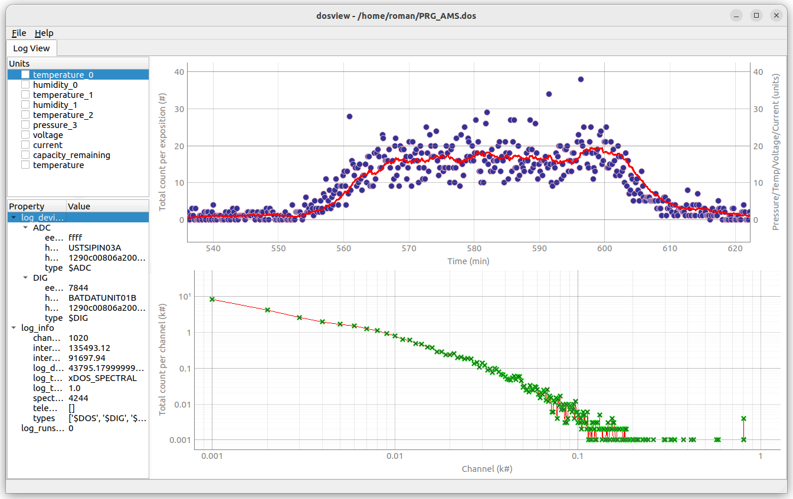

# Overview

Dosview is a powerful log viewer tailored specifically for scientists and users of particle detectors such as [AIRDOS](../AIRDOS) and [LABDOS](../LABDOS).
This tool facilitates the quick viewing and analysis of log data directly from these detectors, providing an efficient means to access and interpret complex data sets.
Dosview is ideal for researchers and professionals who need a streamlined solution for viewing and analyzing data from particle detection operations, 
enabling them to quickly understand the content of their logs without complex software overhead.




## Installation

Installing Dosview is straightforward. You can choose from several methods depending on your preference and the setup of your environment:

### From PyPI Repositories (Recommended for General Use)
To install Dosview from the Python Package Index (PyPI), simply run the following command in your terminal:
```
sudo pip3 install dosview
```
This method is the easiest and ensures you receive the latest stable version available. It is recommended for most users as it provides a straightforward installation process. 

### Update Dosview
To update Dosview to the latest version, use the pip command as follows:
``` bash
sudo pip3 install --upgrade dosview
```
This command will check for the latest version of Dosview on PyPI and update it if a newer version is available. Using pip to manage your installation makes it easy to keep Dosview updated.

### From GitHub Repository Using pip
If you prefer to install the latest version directly from the source code on GitHub, follow these steps:
1. Ensure you have pip3 installed on your system.
2. Run the following command:
   ```
   sudo pip3 install git+https://github.com/UniversalScientificTechnologies/dosview.git
   ```

### From Local Repository Clone Using pip
To install from a local clone of the repository:
1. Ensure you have pip3 installed on your system.
2. Run the following command:
   ```
   git clone https://github.com/UniversalScientificTechnologies/dosview.git
   cd dosview
   sudo pip3 install .
   ```


## Usage

Using Dosview is designed to be as simple as possible to allow quick access to log files. 
