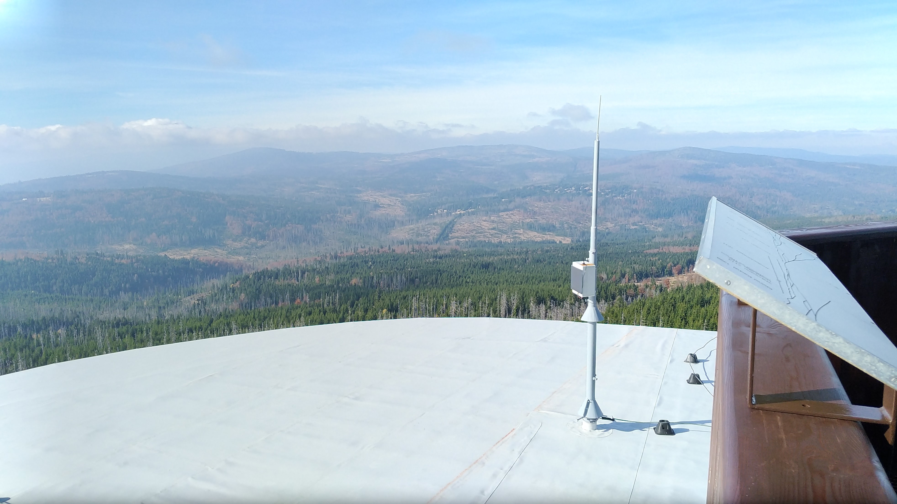

# GEODOS01 – Stand-alone Ionizing Radiation Monitor

GEODOS01 is a scintillation detector for ionizing radiation, designed for long-term unattended outdoor operation. Its construction makes it particularly suitable for deployment in mountain regions or remote areas where power and network access are limited.



## Overview

The device provides fully autonomous detection, logging, and telemetry of radiation events, including backup power and solar charging. It is a robust system proven in long-term environmental monitoring campaigns and scientific research projects, including installations in the Šumava Mountains, Chernobyl Red Forest, and Kosetice Atmospheric Tower.

GEODOS01 serves as a reference instrument in several CRREAT project installations for studying thunderstorm-related radiation phenomena.

## Key Features

* Detection element: NaI(Tl) scintillation crystal (⌀14×20 mm) with integrated SiPM
* Power source: solar panel with LTO battery backup
* Data logging: SD card storage
* Communication: LoRa IoT telemetry
* Time accuracy: 500 ns
* Spectral resolution: 0.02 MeV
* Operational range: −30 °C to +50 °C
* Measurement autonomy: ~6 months per 2 GB SD card
* Open‑source hardware and firmware


## Technical Specifications

| Parameter             | Value                            |
| --------------------- | -------------------------------- |
| Detection crystal     | NaI(Tl) ⌀14 mm × 20 mm with SiPM |
| Energy range          | 0.3 – 18 MeV                     |
| Time resolution       | 20 µs                            |
| ADC conversion time   | 104 µs                           |
| Dead time             | 2 µs                             |
| Power                 | Solar panel + LTO backup         |
| Data storage          | SD card                          |
| Communication         | LoRa WAN                         |
| Operating temperature | −30 °C to +50 °C                 |
| Enclosure             | Spelsberg TK PS 2518‑11‑o (IP33) |


## Data and Communication

GEODOS01 transmits data using an NMEA‑0183‑like textual protocol with two primary message types:

### Histogram message

```
$HIST,8,118.15,960.09,4.06,2.33,394,803,0,3,30656,2401,...
```

Represents accumulated energy histogram values.

### Events message

```
$HITS,20,916,84,2984,37,16386,38,30666,26,...
```

Reports individual radiation events with timestamp and energy channel.

Messages are transmitted over LoRa or stored locally on the SD card for later analysis.

## Publications

* *Monitoring of ionizing radiation from thunderstorms in Bohemian Forest using standalone device GEODOS.* [Read online (NP Šumava, 2024)](https://www.npsumava.cz/wp-content/uploads/2024/11/ambrozova_web.pdf)

