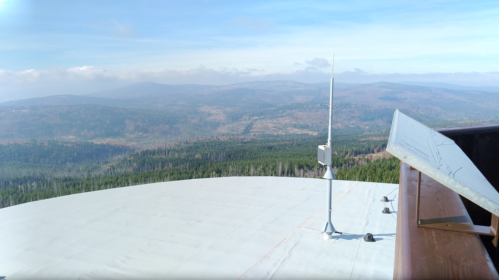
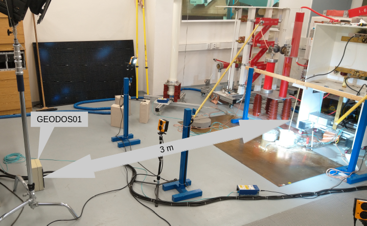
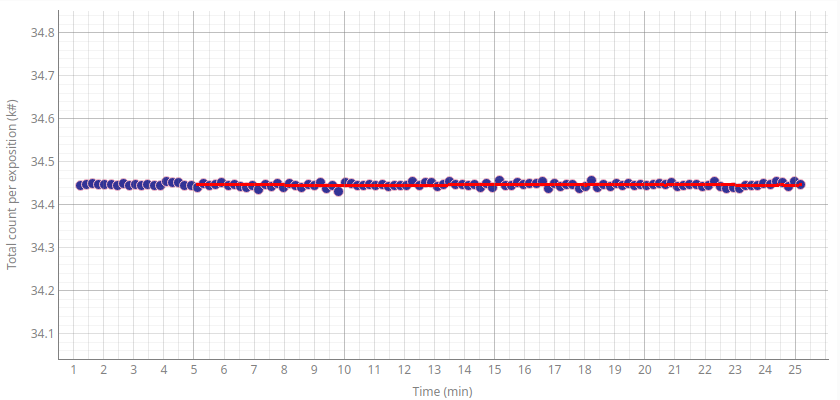
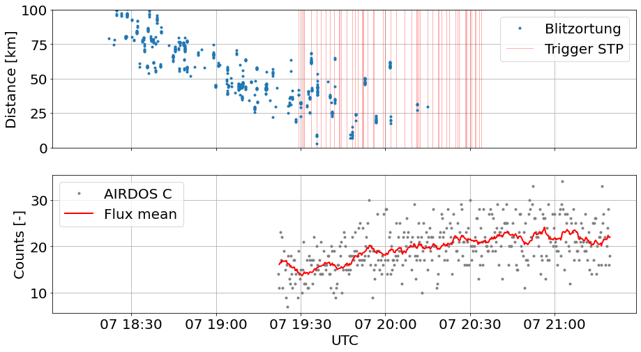
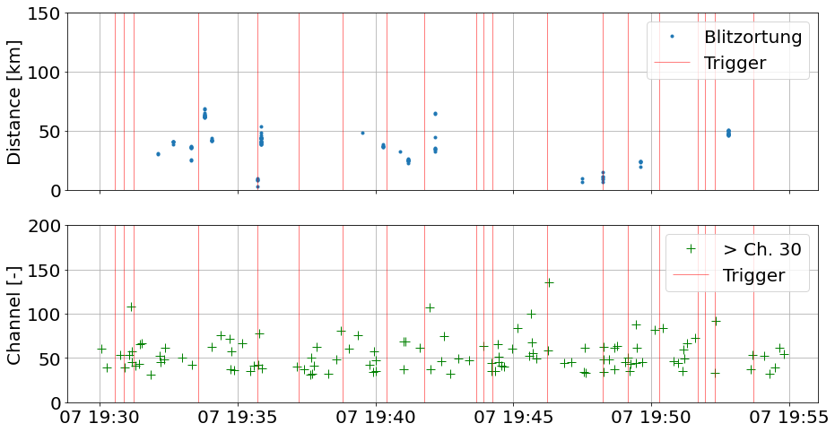
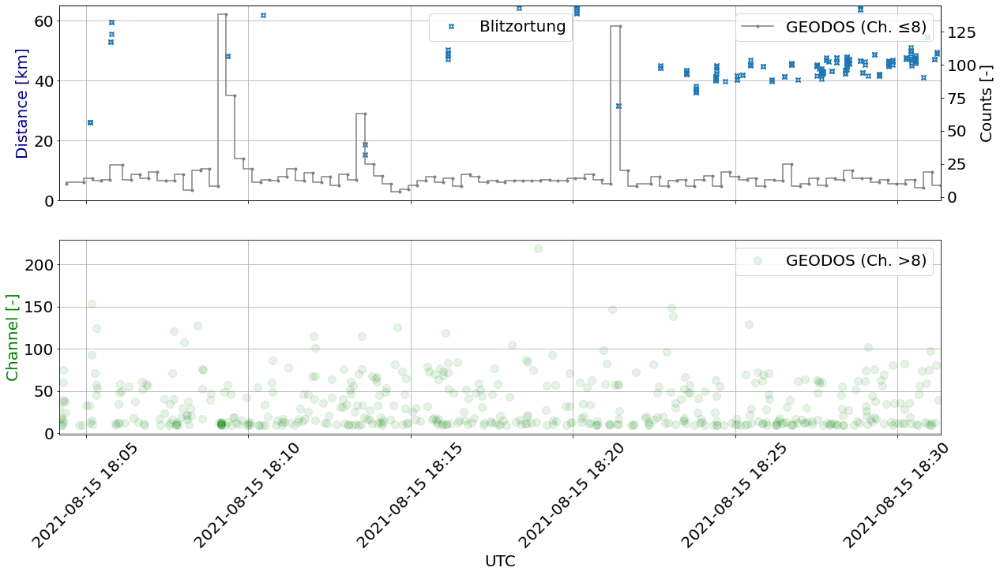

# GEODOS01 – Stand-alone Ionizing Radiation Monitor

GEODOS01 is a scintillation detector for ionizing radiation, designed for long-term unattended outdoor operation. Its construction makes it particularly suitable for deployment in mountain regions or remote areas where power and network access are limited.



## Overview

The device provides fully autonomous detection, logging, and telemetry of radiation events, including backup power and solar charging. It is a robust system proven in long-term environmental monitoring campaigns and scientific research projects, including installations in the Šumava Mountains, Chernobyl Red Forest, and Kosetice Atmospheric Tower.

GEODOS01 serves as a reference instrument in several CRREAT project installations for studying thunderstorm-related radiation phenomena.

## Key Features

* Detection element: NaI(Tl) scintillation crystal (⌀14×20 mm) with integrated SiPM
* Power source: solar panel with LTO battery backup
* Data logging: SD card storage
* Communication: LoRa IoT telemetry
* Time accuracy: 500 ns
* Spectral resolution: 0.02 MeV
* Operational range: −30 °C to +50 °C
* Measurement autonomy: ~6 months per 2 GB SD card
* Open‑source hardware and firmware


## Technical Specifications

| Parameter             | Value                            |
| --------------------- | -------------------------------- |
| Detection crystal     | NaI(Tl) ⌀14 mm × 20 mm with SiPM |
| Energy range          | 0.3 – 18 MeV                     |
| Time resolution       | 20 µs                            |
| ADC conversion time   | 104 µs                           |
| Dead time             | 2 µs                             |
| Power                 | Solar panel + LTO backup         |
| Data storage          | SD card                          |
| Communication         | LoRa WAN                         |
| Operating temperature | −30 °C to +50 °C                 |
| Enclosure             | Spelsberg TK PS 2518‑11‑o (IP33) |


## Data and Communication

GEODOS01 transmits data using an NMEA‑0183‑like textual protocol with two primary message types:

### Histogram message

```
$HIST,8,118.15,960.09,4.06,2.33,394,803,0,3,30656,2401,...
```

Represents accumulated energy histogram values.

### Events message

```
$HITS,20,916,84,2984,37,16386,38,30666,26,...
```

Reports individual radiation events with timestamp and energy channel.

## EMI immunity — lightning current generator test

A GEODOS01 deployed near lightning will be exposed to extremely strong transient electromagnetic fields. To verify that the detector and its electronics are *not* susceptible to false counts under such conditions, the GEODOS01 was tested next to a high-current discharge generator delivering standardised **85 kA, 10/350 µs** waveforms — the same waveform that IEC 62305 uses as a synthetic lightning-current proxy. The detector was placed at 3 m from the discharge setup:



The recorded total count rate during the test, integrated in 10 s windows, shows no deviation or transient increase coincident with the discharge events:



The test confirms that the detector signal chain and shielding are sufficiently resistant to the transient EM fields produced during a lightning discharge. The 85 kA, 10/350 µs waveform is a technical approximation that cannot reproduce the full variability of natural lightning (source geometry, spectral content, rise times, and the spatial distribution of radiated fields) — but it is the most rigorous and reproducible laboratory proxy currently available.

## Radon-progeny washout — the standard ground-level signal

Before any radiation excursion measured by a GEODOS01 during a thunderstorm can be interpreted as a *thunderstorm-related* enhancement, one well-known confounding effect has to be excluded: **radon-progeny washout**.

Radon (²²²Rn) continuously emanates from soil and rock at the ground surface; once airborne it decays through a short chain of short-lived progeny (²¹⁸Po, ²¹⁴Pb, ²¹⁴Bi, ²¹⁴Po). Several of these progeny are γ-emitters and they normally remain at low concentration aloft. Rainfall — including the rain that *precedes* and *accompanies* a thunderstorm — scavenges these aerosol-bound progeny out of the lower atmosphere and deposits them on the ground in concentrated form. As a result, every ground-level scintillation detector sees a temporary **rise in the gamma background by tens of percent**, beginning shortly after the onset of rainfall and decaying over the next 30–60 minutes (the natural half-life of the dominant progeny).

The example below illustrates the magnitude and timing of this signal. A gamma spectrometer (an AIRDOS-C unit; the phenomenon is identical for GEODOS01 — they are the same class of NaI(Tl) + SiPM scintillation detector) was deployed in a parked vehicle near a thunderstorm. The upper graph shows lightning activity from Blitzortung.org; the lower graph shows the detector count rate in 15 s bins. Lightning activity ceased just after 20:30, while the count rate rose by approximately **30 %** after rainfall onset at 19:45:



The detail figure below shows that the high-energy part of the spectrum (above ~2.4 MeV) is unaffected — the washout signal is dominated by the well-known ²¹⁴Bi and ²¹⁴Pb gamma lines well below that threshold. So a true thunderstorm-related radiation enhancement (which is broadband and typically produces detections at all spectrometer channels) can in principle be separated from radon washout simply by looking at the energy spectrum:



In a coordinated multi-instrument deployment ([UST storm measurement vehicles](https://docs.ust.cz/StormCar/) or fixed observatories), radon washout is unambiguously disambiguated from a true thunderstorm-related event using two complementary observations:

1. **Energy spectrum** — washout has a characteristic low-energy line spectrum; thunderstorm events span a broader range. A spectrometer-grade GEODOS01 resolves this directly from its own histogram channel data.
2. **Precipitation timing** — simultaneous precipitation logging shows whether each radiation rise is preceded by rain. UST's [DISDROMETER01](https://docs.ust.cz/DISDROMETER/) is the disdrometer designed specifically for this co-located, hydrometeor-classifying role.

Radon washout is therefore not noise that must be filtered away — it is a known, well-characterised signal that GEODOS01 routinely captures on every rainy day. Recognising and removing it is what makes the residual signal (such as the Polednik event described next) scientifically credible.

## Anomalous radiation event captured at Poledník

GEODOS01 has been deployed on the **Poledník tower** in the Šumava Mountains as part of the [CRREAT](https://crreat.eu/) ground-monitoring network. The instrument captured a new class of ionizing-radiation event that does **not fit** either of the two previously published categories:

* **Terrestrial Gamma-ray Flashes (TGFs)** — microseconds to ~1 ms duration, classically associated with the initiation of intracloud lightning.
* **Thunderstorm Ground Enhancements (TGEs)** — seconds to minutes duration, associated with sustained near-cloud electric fields and the relativistic-runaway-electron-avalanche (RREA) mechanism.

The Poledník event lasted **tens of milliseconds**, in the gap between the two established categories, and occurred during a period of regional thunderstorm activity while the closest localised lightning discharge was many kilometers away. This is consistent with a non-local mechanism or a remote driver, rather than direct overhead generation.



This finding is reported in: I. Ambrožová, M. Kákona, H. Kyznarová, P. Novák, J. Kákona, J. Šlegl, M. Tesař, O. Velychko, O. Ploc, *Monitoring of ionizing radiation from thunderstorms in Bohemian Forest using standalone device GEODOS*, **Silva Gabreta 30**, 63–71, 2024.

Two independent publications in 2024 reported signals of similar duration ([Østgaard et al., *Nature* 2024](https://doi.org/10.1038/s41586-024-07551-5); [Marisaldi et al., *Nature* 2024](https://doi.org/10.1038/s41586-024-07471-4)), independently supporting the existence of a new class of intermediate-duration thunderstorm radiation events.

## Publications

* *Monitoring of ionizing radiation from thunderstorms in Bohemian Forest using standalone device GEODOS.* [Read online (NP Šumava, 2024)](https://www.npsumava.cz/wp-content/uploads/2024/11/ambrozova_web.pdf)

