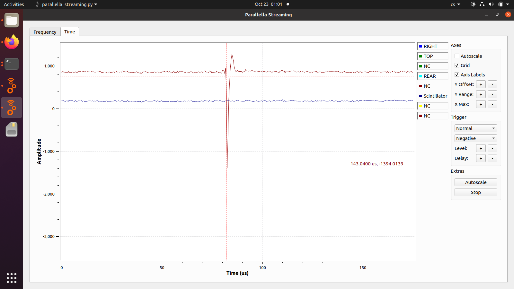

# GEODOS02 – Ionizing Radiation Detector for Research Stations

GEODOS02, also known as CARDOS, is a compact scintillation detector for ionizing radiation based on the [GEODOS01 design](/geodos/GEODOS01/). It has been optimized for **mobile applications**, especially for use in **research vehicles** studying atmospheric radiation phenomena. The device provides a high-precision measurement of gamma radiation but does not include built-in storage, LoRa communication, or an internal time source—these are provided externally by the connected host computer.

## Overview

The GEODOS02 system is designed for flexible integration with measurement stations or vehicles. Data are transmitted in real-time over a USB connection to a recording computer equipped with GNSS for time and position synchronization. This configuration allows accurate correlation of radiation events with other environmental or meteorological measurements.

GEODOS02 is used in field research campaigns, such as thunderstorm-chasing experiments within the CRREAT project and mountain observatory measurements at Lomnický Štít.

## Key Features

* Based on GEODOS01 architecture, optimized for mobile use
* Scintillation crystal NaI(Tl) ⌀10×20 mm with SiPM
* Compact and modular design
* External data recording via USB
* Optional rechargeable Li-ion backup cell
* Time synchronization through the connected host computer
* Open-source hardware and firmware

## Technical Specifications

| Parameter                | Value                                 |
| ------------------------ | ------------------------------------- |
| Detection crystal        | NaI(Tl) ⌀10 mm × 20 mm with SiPM      |
| Energy range             | 0.3 – 18 MeV (extendable up to 40 MeV) |
| Time resolution          | 20 µs                                 |
| ADC conversion time      | 104 µs                                |
| Dead time                | 2 µs                                  |
| Accuracy of event timing | 500 ns                                |
| Power                    | via USB, optional Li-ion cell         |
| Communication            | USB serial                            |
| Operating temperature    | −20 °C to +35 °C                      |
| Charging temperature     | 0 °C to +45 °C                        |

## Example Applications

### Mobile Gamma Spectrometer (CRREAT Project)

GEODOS02 units are mounted in research cars for large-area surveys of ionizing radiation associated with thunderstorms.

## Integration with the VLF lightnin signal receiver

For coincidence studies with lightning radio emission, GEODOS02 can be coupled to a UST [RSMS02 VLF receiver](https://docs.ust.cz/RSMS02/) so that individual scintillation pulses are timestamped on exactly the same clock as the VLF waveform. In this configuration:

* A larger NaI(Tl) crystal is optically coupled with a silicon-photomultiplier module.
* The single-ended SiPM signal is connected through a [SATABAL01](https://www.mlab.cz/module/SATABAL01/) balun transformer.
* The resulting differential signal is fed to a spare ADC channel of the RSMS02 VLF receiver, recorded with full waveform fidelity at 10 MS/s.

The result is a system that can store the time-resolved individual scintillation pulse together with the simultaneous VLF lightning waveform, with a maximum recording length identical to the VLF receiver's pre/post-trigger buffer (~1.45 s). An example single-pulse capture (a cosmic-ray muon outside of storm activity) is shown below:

## Data and Operation

The detector provides a **USB data stream** containing energy and timestamp of each detected event. The host computer is responsible for recording, timestamping, and storage. The data structure is compatible with the same histogram and event message types used in GEODOS01.

