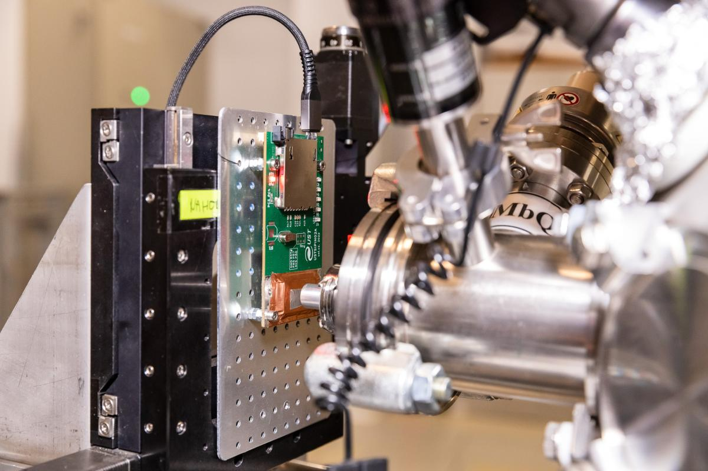
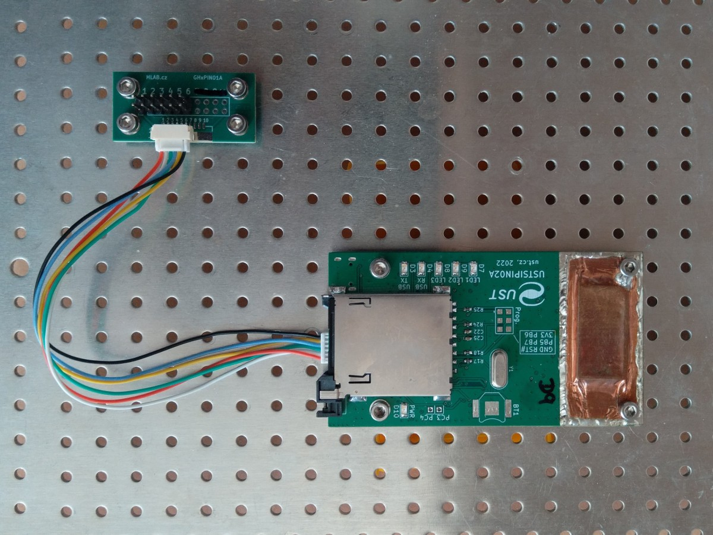
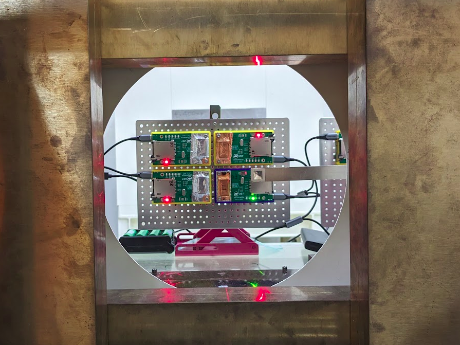
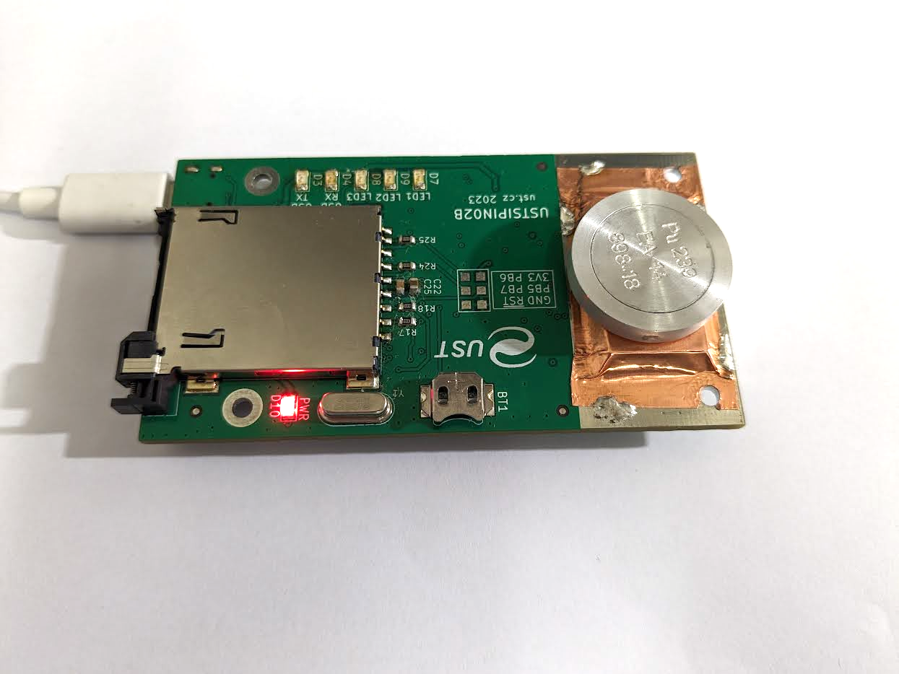
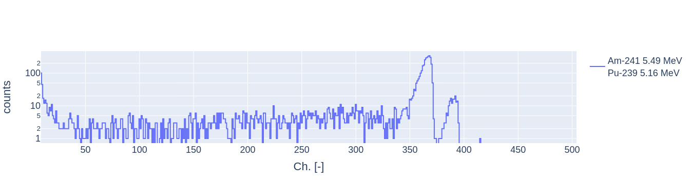

# LABDOS01 Operational Manual

## Introduction

LABDOS01 is a lightweight portable [open-science](https://en.wikipedia.org/wiki/Open_science) ionizing radiation spectrometer-dosimeter intended as an experimental device for laboratory measurements or as a personal dosimeter for frequent flyers. The dosimeter is connected via a USB bus, through which it is powered and read out. This minimizes the demand for skills required to operate the dosimeter.


This device should be used for experimental verification and planning before using our more sophisticated and application-specific devices like [SPACEDOS](https://docs.dos.ust.cz/spacedos/), [AIRDOS](https://docs.dos.ust.cz/airdos/), or [GEODOS](https://docs.dos.ust.cz/geodos).

## Vendor Information 
The LABDOS01 detectors are procured by Universal Scientific Technologies s.r.o. (UST) company. A company specializing in advanced dosimetry and spectrometry equipment. UST is known for its cutting-edge technology and reliable products in the field of radiation detection and measurement. For any further information or support, you can contact us via email at support@ust.cz

## Applications

* Aerospace or Terrestrial Radiation Monitoring
* Aircraft Onboard Radiation Monitoring
* Scientific High Altitude Balloons, e.g., [Pfotzer Maximum measurement](https://en.wikipedia.org/wiki/Georg_Pfotzer)
* Educational Toolkit, [cosmic ray monitoring](https://en.wikipedia.org/wiki/Cosmic_ray) 
* Radiation Mapping in 3D together with GNSS and UAV
* Space Weather Monitoring, e.g., on high-altitude observatories
* [Open science](https://en.wikipedia.org/wiki/Open_science)
* [Citizen science](https://en.wikipedia.org/wiki/Citizen_science)



## Technical Parameters
- Detection element: Silicon PIN diode volume 44 mm³
- Effective number of energy channels: 470 ±3
- Deposited energy ranges: 60 keV to 7 MeV
- Energy measurement resolution: 15 ±2 keV (varies with calibration method and particle type)
- Power supply: 5V, 3 mA (excluding LEDs) via USB-C port or JST-GH connectors 
- Radiation spectra integration time: 10 s
- Deadtime: 
  - Up to 1 second for SD card writing
  - 100 ms for data output to USB
- Interface:
  - USB 2.0 USB-C connector (Virtual Com Port baud rate 115200)
  - 3.3V UART link on JST-GH connector ([Pixhawk telemetry port](https://github.com/pixhawk/Pixhawk-Standards/blob/master/DS-009%20Pixhawk%20Connector%20Standard.pdf))
- Size: 96x56x19mm
- Weight: 76 grams
- Environmental operational conditions:
  - Device protection: IP30 rating
  - Operating temperature range: 0°C to 35°C
  - Operating humidity conditions: non-condensing 20% to 80% RH


### USB-C interface

The main user interface is [USB](https://en.wikipedia.org/wiki/USB) with a USB-C connector used both for power supply and also the data output. 

### JST-GH UART interface

Optional data output over [UART](https://en.wikipedia.org/wiki/Universal_asynchronous_receiver-transmitter). It could also be used for firmware upgrades by switching the solder jumper on the PCB. 

|Signal| Description | 
|--------|-----------|
| +5V  |     Can be used to power LABDOS01 instead of USB | 
| RX  |    data input  | 
| TX |      data output  | 
| CTS |     |  
| RTS |     |  
| GND |   Signal ground  |   

The interface could be used with [GHxPIN01](https://www.mlab.cz/module/GHxPIN01/) for connection to other laboratory devices or experiments. The [MLAB.cz](https://www.mlab.cz/) contains plenty of additional hardware that could be used. 



Additionally, there exists the [TFUSBSERIAL01 gadget](https://docs.thunderfly.cz/avionics/TFUSBSERIAL01/), which could be used for direct connection to the JST-GH UART connector. 

### JST-GH Auxiliary IO

Mainly useful for special tasks like control of external devices depending on radiation intensity or spectral threshold energy. 
Another usage is the connection to an autopilot in a UAV. See the [AIRDOS03](https://www.ust.cz/UST-dosimeters/AIRDOS/#airdos03-uavdos)  for details. 

|Signal| Description |
|--------|------------------|
| TIMEPULSE  |     PPS input          |  
| EXTINT  |     External interupt          |  
| GPIO  |               |  
| SDA |   auxilary I²C data      |  
| SCL  |     auxilary I²C  clock       |   
| TX  |               |   
| RX |              |    
| GND |     Signal ground       |   

## Usage of LABDOS01

Frequent flyers can utilize LABDOS01 in conjunction with a power bank when access to real-time measurements is not available. The device can be connected by a USB power source, while LABDOS01 continuously logs data to the SD card. This setup is particularly useful for travelers who wish to monitor radiation exposure during flights without the need for immediate data access. Users can upload the data from the SD card to online platforms (like [DOSPORTAL](https://docs.dos.ust.cz/dosportal/) as an example), where advanced analysis can be performed to interpret the radiation dose levels and other relevant metrics. This feature is useful for users who may not have access to sophisticated data analysis software, providing a user-friendly and efficient means of understanding the data captured by LABDOS01.


{: .warning }
In the case use of a power bank, it is important to check that the power bank does not switch off after a while. It is a common issue with many power banks caused by the extremely low power consumption of LABDOS01. The issue could be solved by connecting an additional dummy load to the power bank using a USB hub (USB cup heater, USB plasma ball, etc.). 

### Standalone Detector for Unattended Data Logging

In this type of use, LABDOS01 functions as an autonomous unit, recording data directly to its internal storage in the form of an industrial-grade SLC/SLC mode SD card. This setup is ideal for mid-term environmental monitoring or experiments where continuous human oversight is not feasible. The data is stored on the SD card, which can later be retrieved and analyzed. This application is particularly suitable for fixed installations in labs or for monitoring in remote locations.

This mode is perfect for validating local conditions for future experiments. After initial data collection and analysis, it is recommended that LABDOS01 be replaced with one of the UST detectors optimized for long-term standalone use, such as [GEODOS](https://docs.dos.ust.cz/geodos), [AIRDOS](https://docs.dos.ust.cz/airdos/), or [SPACEDOS](https://docs.dos.ust.cz/spacedos/) detectors. These specialized detectors are tailored for sustained, unattended operations, providing enhanced reliability and data accuracy in various environmental conditions.


### Use with Mobile Device or Computer for Data Processing

When connected to a compatible mobile phone or a computer, LABDOS01 serves as a real-time detector and spectrometer. The detector sends data, after each exposition interval, directly to the connected device. This usage is highly beneficial for interactive experiments, educational purposes, or situations where immediate data analysis and visualization are required. The accompanying software on the device can be used for in-depth analysis and graphical representation of the detected particle data, enhancing the understanding and interpretation of the results.


### Laboratory Use with Artificial Sources

In laboratory setups, it is possible to use LABDOS01 for the detection of radiation from weak artificial sources (e.g., low-activity ²⁴¹Am, or particle accelerators). For such purposes, it is recommended to open the LABDOS01 housing and directly irradiate the internal copper entrance window.

This configuration has been successfully validated in controlled accelerator environments such as HIMAC.



LABDOS01 includes a \~50 µm copper foil with a small hole covered by a thinner aluminium foil located directly above the silicon PIN diode. This copper layer is thin enough to allow detection of charged particles. However, a thin aluminum protective foil is also placed above the hole in the copper foil - this window is used for energy calibration during manufacturing.  If left in place, this aluminium foil blocks light and alpha particles and only allows detection of secondary electrons, resulting in distorted spectra.

To allow detection of primary alpha particles:

* **Carefully remove the aluminum foil** covering the window with tweezers.
* Irradiate the detector directly through the hole in the exposed copper foil window in complete darkness.

{: .important }
This operation requires mechanical disassembly and may void the warranty. Proceed only if you fully understand the consequences and risks involved.







### Direct Data Stream Capturing

Reading the data stream from LABDOS01 via USB involves capturing and analyzing the data transmitted from the device to a connected computer or mobile device. The USB data streaming approach is particularly beneficial for mid-term monitoring scenarios where real-time data publication is desired, such as displaying radiation measurements on a website or generating live data feeds for other applications. This method requires dedicated software to handle the data streaming and publishing processes. The software interprets the data stream from LABDOS01 and converts it into a suitable format for online publishing or other forms of output, enabling continuous and dynamic sharing of radiation data in real-time. This feature is especially useful in scientific research, public monitoring projects, or educational demonstrations.


### Steps to Read Data Stream

1. Connect LABDOS01 using a USB-C cable.
2. Ensure device recognition and enumeration as a virtual serial line.
3. Launch data logging software (e.g., picocom, minicom, or Putty).
4. Adjust settings in your logging software according to the data format and baud rate (default baud rate is 115200) used by LABDOS01.
5. Start capturing the data stream.

{: .important }
- Verify that you use the correct data format and firmware for the intended experiment.
- Use of a high-quality connection cable.

#### Linux

The device should appear as a virtual serial line without any external drivers. Many serial logging tools could be used to log the LABDOS output, for example, `picocom` or `minicom`. Look to [LABDOS01A/sw](https://github.com/UniversalScientificTechnologies/LABDOS01/tree/LABDOS01A/sw) for details. 


    $ picocom /dev/ttyUSB0 -b 115200
    picocom v3.1
    
    port is        : /dev/ttyUSB0
    flowcontrol    : none
    baudrate is    : 115200
    parity is      : none
    databits are   : 8
    stopbits are   : 1
    escape is      : C-a
    local echo is  : no
    noinit is      : no
    noreset is     : no
    hangup is      : no
    nolock is      : no
    send_cmd is    : sz -vv
    receive_cmd is : rz -vv -E
    imap is        : 
    omap is        : 
    emap is        : crcrlf,delbs,
    logfile is     : none
    initstring     : none
    exit_after is  : not set
    exit is        : no
    
    Type [C-a] [C-h] to see available commands
    Terminal ready
    #Cvak...
    #Hmmm...
    #Filesize,236432
    #Filename,0.txt
    $DOS,LABDOS01B,8.0.3-128-Release.L500,510,3d59216293a1398e4801ba42fa14ccb0f71,Release,00806a200905013a0093890067
    $HIST,0,11.23,20524,1,978,14228,10217,134,0,0,0,0,0,0,0,0,0,0,0,0,0,0,0,0,0,0,1,0,0,0,0,0,0,0,0,0,0,0,0,0,0,0,0,0,0,0,0,0,0,0,0,0,0,0,0,0,0,0,0,0,0,0,0,0,0,0,0,0,0,0,0,0,0,0,0,0,0,0,0,0,0,0,0,0,0,0,0,0,0,0,0,0,0,0,0,0,0,0,0,0,0,0,0,0,0,0,0,0,0,0,0,0,0,0,0,0,0,0,0,0,0,0,0,0,0,0,0,0,0,0,0,0,0,0,0,0,0,0,0,0,0,0,0,0,0,0,0,0,0,0,0,0,0,0,0,0,0,0,0,0,0,0,0,0,0,0,0,0,0,0,0,0,0,0,0,0,0,0,0,0,0,0,0,0,0,0,0,0,0,0,0,0,0,0,0,0,0,0,0,0,0,0,0,0,0,0,0,0,0,0,0,0,0,0,0,0,0,0,0,0,0,0,0,0,0,0,0,0,0,0,0,0,0,0,0,0,0,0,0,0,0,0,0,0,0,0,0,0,0,0,0,0,0,0,0,0,0,0,0,0,0,0,0,0,0,0,0,0,0,0,0,0,0,0,0,0,0,0,0,0,0,0,0,0,0,0,0,0,0,0,0,0,0,0,0,0,0,0,0,0,0,0,0,0,0,0,0,0,0,0,0,0,0,0,0,0,0,0,0,0,0,0,0,0,0,0,0,0,0,0,0,0,0,0,0,0,0,0,0,0,0,0,0,0,0,0,0,0,0,0,0,0,0,0,0,0,0,0,0,0,0,0,0,0,0,0,0,0,0,0,0,0,0,0,0,0,0,0,0,0,0,0,0,0,0,0,0,0,0,0,0,0,0,0,0,0,0,0,0,0,0,0,0,0,0,0,0,0,0,0,0,0,0,0,0,0,0,0,0,0,0,0,0,0,0,0,0,0,0,0,0,0,0,0,0,0,0,0,0,0,0,0,0,0,0,0,0,0,0,0,0,0,0,0,0,0,0,0,0,0,0,0,0,0,0,0,0,0,0,0,0,0,0,0,0,0,0,0,0,0,0,0,0,0,0,0,0,0,0,0,0,0,0,0,0,0,0,0,0,0,0,0,0,0,0,0,0,0,0,0,0,0,0,0,0,0,0,0,0
    $HIST,1,22.39,20493,4,1031,14168,10241,146,1,2,0,0,0,0,0,0,1,0,0,0,0,0,0,0,0,0,0,0,0,0,0,0,0,0,0,0,0,0,0,0,0,0,0,0,0,0,0,0,0,0,0,0,0,0,0,0,0,0,0,0,0,0,0,0,0,0,0,0,0,0,0,0,0,0,0,0,0,0,0,0,0,0,0,0,0,0,0,0,0,0,0,0,0,0,0,0,0,0,0,0,0,0,0,0,0,0,0,0,0,0,0,0,0,0,0,0,0,0,0,0,0,0,0,0,0,0,0,0,0,0,0,0,0,0,0,0,0,0,0,0,0,0,0,0,0,0,0,0,0,0,0,0,0,0,0,0,0,0,0,0,0,0,0,0,0,0,0,0,0,0,0,0,0,0,0,0,0,0,0,0,0,0,0,0,0,0,0,0,0,0,0,0,0,0,0,0,0,0,0,0,0,0,0,0,0,0,0,0,0,0,0,0,0,0,0,0,0,0,0,0,0,0,0,0,0,0,0,0,0,0,0,0,0,0,0,0,0,0,0,0,0,0,0,0,0,0,0,0,0,0,0,0,0,0,0,0,0,0,0,0,0,0,0,0,0,0,0,0,0,0,0,0,0,0,0,0,0,0,0,0,0,0,0,0,0,0,0,0,0,0,0,0,0,0,0,0,0,0,0,0,0,0,0,0,0,0,0,0,0,0,0,0,0,0,0,0,0,0,0,0,0,0,0,0,0,0,0,0,0,0,0,0,0,0,0,0,0,0,0,0,0,0,0,0,0,0,0,0,0,0,0,0,0,0,0,0,0,0,0,0,0,0,0,0,0,0,0,0,0,0,0,0,0,0,0,0,0,0,0,0,0,0,0,0,0,0,0,0,0,0,0,0,0,0,0,0,0,0,0,0,0,0,0,0,0,0,0,0,0,0,0,0,0,0,0,0,0,0,0,0,0,0,0,0,0,0,0,0,0,0,0,0,0,0,0,0,0,0,0,0,0,0,0,0,0,0,0,0,0,0,0,0,0,0,0,0,0,0,0,0,0,0,0,0,0,0,0,0,0,0,0,0,0,0,0,0,0,0,0,0,0,0,0,0,0,0,0,0,0,0,0,0,0,0,0,0,0,0,0,0,0,0,0,0,0,0,0,0,0,0,0,0,0,0,0,0,0,0,0
    
    

#### Android

The device should appear as a virtual serial line without any external drivers. Many serial logging tools could be used to log the LABDOS output, for example, [Serial USB terminal](https://play.google.com/store/apps/details?id=de.kai_morich.serial_usb_terminal).

#### Windows

For computers with Windows, you will need to install a driver for [FTDI USB](https://ftdichip.com/drivers/) converter. Then you could use the [putty](https://www.putty.org/) which is a program that can be used for logging. One of the tutorials on how to set up data logging using Putty is [here](https://my.kualo.com/knowledgebase/?kbcat=0&article=888) for example.

### Recording on SD card

Data in the LABDOS01 is always logged when an SD card is present and functional. In that case, the LABDOS01 needs an external power supply e.g. power bank or smartphone. The LABDOS could be connected by any sufficiently reliable USB-C to USB-C/USB-A cable. The recording of the card is indicated by the illumination of LED2. If the card is inserted and LED2 does not blink between exposures, there might be an issue with the SD card. It's advisable to check the card on a computer. The problem could be due to using an incorrect type of SD card, improper formatting, or damage to the card media.

{: .note }
SD cards in environments with elevated radiation levels may degrade more quickly. Therefore, it's recommended to proactively replace the SD card annually with a suitable and supported type. For information on availability and the correct type of card, contact technical support. Only industrial SLC SD cards with a properly implemented SPI interface are supported.

{: .important }
The presence and recording of an SD card in LABDOS01 can cause variable dead time, depending on the condition of the SD card and filesystem. This dead time can be as long as one second. To minimize dead time, remove the SD card and log data externally via the data stream (USB/UART). This method ensures more continuous data capture with reduced interruptions, making it more suitable for applications where minimizing deadtime is critical.


## Experiment Evaluation

The data measured by the LABDOS is stored as text files. The exact format description of these files depends on the device's firmware. The recorded data files can be analyzed with custom software tools based on the [example dose calculation script](https://github.com/UniversalScientificTechnologies/LABDOS01/blob/LABDOS01B/notebooks/flight_dose_calculation.ipynb), or you can use the [dosportal](https://portal.dos.ust.cz) web application for managing and evaluating data measured by UST instruments.


## Maintenance

### Minimal Maintenance
The LABDOS01 is a low-maintenance device, requiring minimal upkeep when operated within its specified conditions. Adhering to its operational guidelines ensures reliable performance without the need for special maintenance routines.

{: .highlight }
The only consumable component in the detector is the SD card, which is used for data storage. Described in the section above. Regular replacements of the SD card are essential for maintaining the detector's efficiency and reliability.

### Firmware Update

**Updating Process**

  1. Download the Latest Firmware: Access the latest firmware as a release on GitHub or request it directly from the UST.
  1. Connect LABDOS01 to a Computer: Use a USB-C cable for connection.
  1. Initiate Firmware Update (Avoid disconnecting during the update process.):
     
     `avrdude -v -patmega1284p -carduino -P/dev/ttyUSB0 -b57600 -D -Uflash:w:<fw_path>:i`

      Replace `<fw_path>` with the path to the downloaded firmware file. Ensure the `/dev/ttyUSB0` port matches the port where the programming device is connected.
     
**Additional requirements**

  1. Power Stability: Ensure a quality USB-C cable is used.
  1. Compatibility Check: Verify firmware compatibility with your LABDOS01 model.
  1. Post-Update Testing: After updating, it's important to test the detector to ensure it functions correctly as expected. This step verifies that the update has been successful and the device operates as intended. It can be done by 
  1. Connecting a detector to any device where you can open the serial line terminal.
  1. Remember, the steps outlined here are general guidelines. Always follow the latest online instructions (https://docs.dos.ust.cz/) for accurate and up-to-date procedures.


## FAQ

### How to check the correct logging
Red Power LED must be light on. The blue and green LEDs flash every ten seconds.

### How to reset the LABDOS connected over the USB serial link? 

The reset could be requested by toggling the DTR signal. The exact implementation of how the DTR UART signal could be accessed depends on the implementation of serial communication software. For example in [picocom](https://linux.die.net/man/8/picocom) is asserted by Ctrl+A and Ctrl+P. 

### How to split Individual file Records of Energy Spectra from the LABDOS01 SDcard log file

The LABDOS01 device performs measurements of energy spectra and stores them in a single file on an SD card, typically named "0.TXT". It is desirable to split the file into individual records to efficiently process and analyze this data. For this purpose, the `csplit` command can be used, allowing for the automated splitting of the logging file into smaller parts based on a specified line containing a desired pattern.

Description:
The `csplit` command is used to split the logging file of the LABDOS01 device, which contains partial records of energy spectra, into individual measurements. This command enables automated and efficient division of the input file into smaller sections based on a specified line with the desired pattern.

Usage:

1. Create a folder for the output files:
   ```
   mkdir split
   ```

2. Use the `csplit` command to split the logging file "0.TXT" into individual records:
   ```
   csplit -f split/0_ 0.TXT '/\$DOS,LABDOS01/' {*}
   ```

   The `csplit` command utilizes the regular expression `/\$DOS,LABDOS01/` to identify the line that separates the individual energy spectra records. The output files will be stored in the "split" folder with the prefix "0_" and assigned sequential numbers.

   Upon executing this command, output files containing the individual energy spectra records from the "0.TXT" logging file will be created. These files can be further processed or analyzed independently.


#### Inline variant of command with the creation of the output folder and composing each sub-record file

```
mkdir -p split && cat *.TXT > compose.txt && csplit -b "%04d.dos" -f split/ compose.txt '/$DOS,LABDOS01/' {*}
```


### Can LABDOS01 be used to detect radiation from artificial sources like ²⁴¹Am?

Yes, with limitations. LABDOS01 is optimized for detecting charged particles, such as those found in cosmic rays or ion beams. Its silicon PIN diode has low sensitivity to high-energy gamma photons, which interact weakly with thin silicon layers. Therefore, the response to gamma radiation from typical artificial sources (e.g. ⁶⁰Co, ¹³⁷Cs) is low, especially at higher energies.

Alpha emitters like **²⁴¹Am** can be used in laboratory settings, but requires removing the aluminum protective foil that blocks direct particle access to the detector. To avoid distortion of the energy deposition spectrum by the **energy loss in the aluminium entrance window** (\~20 µm).

For more information and practical instructions, see the section [Laboratory Use with Artificial Sources](#laboratory-use-with-artificial-sources).


## Recycling and Disposal

The device constitutes customer electronic waste without additional batteries or another harmful substance.  Dispose of it according to the regulations of your country. The device is RoHS-compliant. 

## Safety Instructions and Warranty

Universal Scientific Technologies s.r.o. shall not be liable for any damages, injuries, or regulatory non-compliance arising from improper use, maintenance, or unauthorized device alterations. Unauthorized interventions in the device or handling that contradict the instructions provided in the manual and detector online documentation will result in the loss of warranty.


