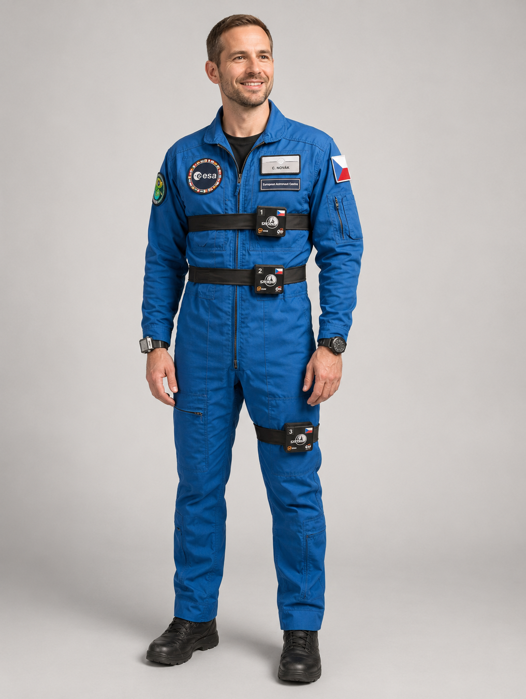

# SPACEDOS04 - Personal Active Dosimeter for manned deep space missions

{: .warning }
SPACEDOS04 is currently under development. Parameters listed below are design targets and may change before the flight model is finalized.

SPACEDOS04 is a wearable radiation dosimeter for manned deep space and ISS missions, measuring ionizing radiation dose received by an astronaut using a silicon PIN diode detector combined with passive detectors (TLD and nuclear track detectors). It forms a Space Dosimeter Unit (SDU) together with a wristwatch-style Display and Data Unit (DDU) that provides real-time dose readout.

The device is being developed as part of the [CZPAD experiment](https://ceskacestadovesmiru.cz/czpad/) onboard the International Space Station (ISS), which serves as the qualification path towards a flight-proven, deployable instrument.

## Key feature: real-time neutron discrimination

A significant, but usually poorly quantified, part of an astronaut's radiation exposure onboard the ISS or during deep space missions comes from neutrons - both from albedo neutrons produced when cosmic rays and trapped protons interact with the spacecraft structure, and from other neutron sources encountered during the mission. Conventional dosimetry cannot separate this out: passive dosimeters (TLD, track detectors) only report the total accumulated dose after the mission is over, and standard active silicon dosimeters cannot distinguish neutrons from the much stronger background of directly ionizing charged particles.

SPACEDOS04's key advantage over previous SPACEDOS generations is that it can tell neutrons apart from other radiation **in real time, during the measurement itself** - not just as a total dose after the fact. This is achieved by adding a thin neutron-conversion layer (Li-6 in the form of LiF or Li2CO3) on top of its silicon PIN diode. A thermal neutron captured in Li-6 produces a triton and an alpha particle with a well-defined, fixed energy (Li-6 + n &rarr; H-3 + He-4), which shows up in the diode's energy spectrum at a characteristic position distinguishable from the continuous charged-particle background - the "SPACEDOS method" for neutron flux estimation. Combined with the co-located passive detectors, this gives customers a significantly better estimate of the actual personal dose equivalent (Hp), broken down by radiation type, instead of a single delayed total-dose figure.

Two detector concepts are being evaluated to make this discrimination robust against the intense charged-particle background: a single diode with a full-area conversion layer compared against a bare reference diode, and a coincidence arrangement with two silicon sensors sandwiching the conversion layer, where a simultaneous signal in both sensors is a much stronger indicator of a neutron event. The DDU is intended to show separate real-time counts for neutrons and for other particles, so the wearer sees the breakdown directly on the wrist.

The [CZPAD experiment](https://ceskacestadovesmiru.cz/czpad/) onboard the ISS is where this capability is being validated in a real spaceflight environment, ahead of SPACEDOS04 becoming a standard, flight-proven product.

## System overview

Each SDU consists of a SPACEDOS04 electronic dosimeter, a set of passive detectors (TLD and nuclear track detectors), and a Nomex pouch for mechanical protection and flame retardancy. The SDU can be attached to the cosmonaut's body (waist strap, chest strap, thigh strap) or to the ISS structure (hook & loop adhesive pads).

## Hardware

The SPACEDOS04 electronics consists of three PCBs:

* **Baseboard** - MCU, Battery Management System (BMS), and a Bluetooth Low Energy RF interface to the DDU wristwatch display
* **Sensor board** - silicon PIN diode detector and the analogue signal processing chain
* **Flex PCB** - mechanical and electrical interconnect between the baseboard, sensor board, and the Li-ion battery cell

## Parameters (design targets)

* Silicon PIN diode detector, at least 28 x 28 x 0.5 mm³, with a Li-6 (LiF/Li2CO3) neutron converter layer for real-time neutron discrimination (see [Key feature](#key-feature-real-time-neutron-discrimination) above)
* Deposited energy range: 50 keV to 100 MeV 
* Data storage device: SD card (~1 GiB), FAT filesystem, human-readable log format
* Charging: USB-C
* Battery endurance: at least 5 days
* Dimensions (without pouch): approx. 80 x 70 x 20 mm (± 5 x 3 x 2 mm)
* Mass: estimated 148 - 184 g (SDU including battery cell and shielding, excluding pouch)
* Vibration resistance per Crew Dragon / ISS JSC-20793 requirements

