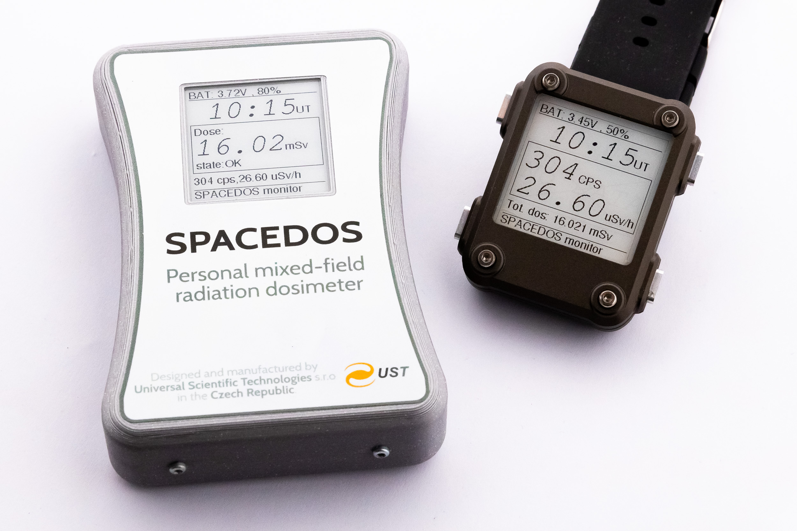

The SPACEDOS solid-state dosimeter series is suitable for extreme radiation conditions of space missions. Silicon semiconductor deposited energy spectrometer technology has outstanding sensitivity to charged particles, which are the main and the most dangerous part of the primary cosmic ray. 
It comes in two variants: one for manned and one for unmanned missions, differing mainly in their interfaces. The manned mission variant is a smarter equivalent of a passive dosimeter that can be used by astronauts while the unmanned version can be integrated into spacecraft systems like satellites. Both options require only a minimum power.  Both types prioritize safety and reliability, with a power supply based on onboard sources or chemical cells, depending on the mission type. They’re designed for single-mission use, able to operate without maintenance.

The overview of SPACEDOS variants:

  * [SPACEDOS01](./SPACEDOS01.md) - Unmanned missions onboard small satellites (CubeSats)
  * [SPACEDOS02](./SPACEDOS02.md) - Manned missions, LEO/MEO orbits
  * [SPACEDOS03](./SPACEDOS03.md) - Manned missions, radiation shielding material testing.

## DEMODOS analogous mission training model

In addition to the SPACEDOS product line, there is a dedicated training model (DEMODOS) for the SPACEDOS personal dosimeter, designed specifically for analog or training missions. This simulator offers a realistic simulation of the radiation environment that astronauts may encounter during space flights. The system consists of a Personal Active Dosimeter (PAD) and a Dosimeter Display Unit (DDU), both wearable devices simulating real-time radiation measurements. The training system allows remote control and adjustment of radiation levels, which are then displayed on the DDU. The DDU also provides vibration alerts to notify astronauts when preset radiation limits are exceeded.

The training model is particularly useful in simulating various space weather conditions, including solar events such as solar flares, Coronal Mass Ejections (CME), and Solar Energetic Particle (SEP) events. These simulations are essential for preparing astronauts to respond to potential radiation hazards caused by solar activity. The system can integrate with external forecasting and nowcasting tools, such as ESA's Solar Energetic Particle (SEP) Advanced Warning System (SAWS) and the Advanced Solar Particle Events Casting System (ASPECS), to simulate the likelihood of radiation exposure in real-time.

This simulator, combined with data from forecasting tools, provides a complete time profile of radiation levels and potential impacts on the human body and onboard hardware. These simulations not only enhance the realism of the training but also help in the dose assessment, offering insights into the radiobiological effects of space radiation.

One of the key benefits of this training model is that it ensures participant safety, as no actual harmful radiation is involved. This allows for realistic and effective preparation for various radiation scenarios without putting astronauts' health at risk.
  
